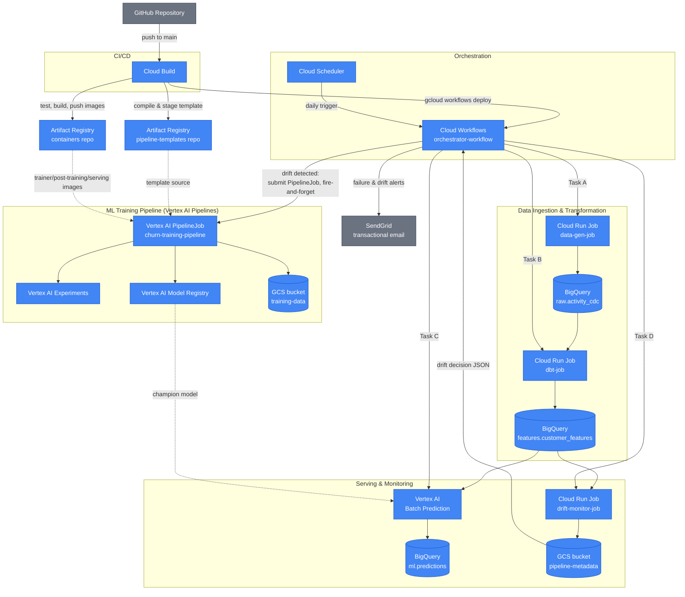

# Serverless Customer Churn MLOps Platform

## Overview

This repository contains a production-grade, end-to-end MLOps platform for customer churn prediction built entirely on Google Cloud Platform (GCP). Moving beyond the limitations of static datasets and fragile time-based scheduling, this architecture implements a dynamic, living system capable of synthetic data generation, automated feature engineering, robust machine learning workflows, and closed-loop drift remediation.

The primary engineering objective of this project is to model an enterprise-ready infrastructure ecosystem. The core system isolates application concerns, enforces deterministic dependency management, runs fully serverless to optimize costs, and handles operational failures or data distribution shifts autonomously. All continuous integration and continuous deployment pipelines are natively driven by Google Cloud Build.

---

## Tech Stack

* **Data Warehouse:** Google BigQuery
* **Transformation Engine:** dbt Core (Containerized on Cloud Run)
* **ML Infrastructure:** Vertex AI Pipelines (Kubeflow SDK)
* **Experiment Tracking:** Vertex AI Experiments (native SDK)
* **Orchestration:** Google Cloud Workflows
* **CI/CD Platform:** Google Cloud Build
* **Code Quality:** Ruff (lint & format) enforced by pre-commit hooks
* **Compute Layer:** Cloud Run Jobs & Vertex AI Training
* **Infrastructure as Code:** Terraform
* **Data Generation:** Python (NumPy)
* **Email Delivery:** SendGrid (transactional operational alerts)

---

## System Architecture

The diagram below shows the GCP services this platform is built on and how they connect — from CI/CD, through the daily ingestion/transformation/serving loop, to the drift-triggered retraining pipeline.

Every deployable in this diagram is provisioned by Terraform — see [docs/iac.md](docs/iac.md). For the step-by-step daily and retraining flows, see [docs/orchestration.md](docs/orchestration.md).

---

## Documentation

| Topic | File |
|-------|------|
| Prerequisites & Setup | [docs/setup.md](docs/setup.md) |
| Software Architecture & Monorepo Design | [docs/architecture.md](docs/architecture.md) |
| Data Lifecycle & ELT Engine | [docs/data-lifecycle.md](docs/data-lifecycle.md) |
| Event-Driven Orchestration | [docs/orchestration.md](docs/orchestration.md) |
| Model Development (DS guide) | [docs/model-development.md](docs/model-development.md) |
| ML Infrastructure (MLE guide) | [docs/ml-infrastructure.md](docs/ml-infrastructure.md) |
| Feature Exploration & Selection | [docs/feature-exploration.md](docs/feature-exploration.md) |
| Observability & Drift Remediation | [docs/observability.md](docs/observability.md) |
| Infrastructure as Code (Terraform) | [docs/iac.md](docs/iac.md) |
| CI/CD Deployment Blueprint | [docs/cicd.md](docs/cicd.md) |

---

## License

Licensed under the [PolyForm Noncommercial License 1.0.0](LICENSE.md), provided "as is", without warranty of any kind.

* **Noncommercial use** (personal, research, education, nonprofit/government) — free to use, modify, and redistribute.
* **Commercial or business use** — requires a separate paid license. Contact [marcopellegrinoit](https://github.com/marcopellegrinoit).
