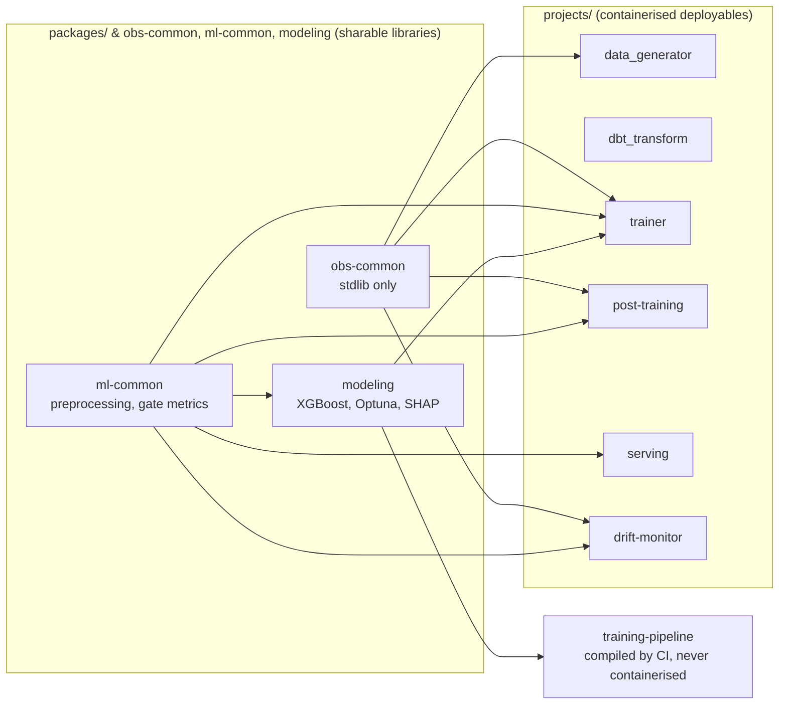

# Software Architecture & Monorepo Design

This repository is organized as a unified workspace powered by `uv`. Rather than allowing dependency bleed across the codebase, a strict separation of concerns is maintained between deployable applications and reusable code utilities.

## The Workspace Paradigm

The repository uses a single, global lockfile to guarantee complete reproducibility and version parity across all development, staging, and production environments. By defining independent project modules within a single workspace, the system enforces hard boundaries around individual execution contexts while still providing a local, direct method for consuming internal code libraries.

**Cross-project imports are opt-in, not automatic.** Sharing one workspace lockfile does not mean every container can import every other project's code. A project's source only becomes importable inside another project's container when both of the following are true: (1) the consuming project declares it as a dependency in its own `pyproject.toml`, and (2) the consuming project's `Dockerfile` explicitly `COPY`s that dependency's `pyproject.toml` and `src/` before running `uv sync --package <name>`. For example, `trainer/Dockerfile` copies in `ml-common` and `modeling` because `trainer` depends on both — but `serving`'s Dockerfile only copies `ml-common`, so `serving` cannot import `trainer` or `modeling` code even though they live in the same workspace. Each `Dockerfile` is therefore the actual enforcement point for import boundaries between deployables, not just a build-speed optimization.



Each arrow is a real `pyproject.toml` dependency, enforced at build time by the consuming project's Dockerfile as described above — `dbt_transform` depends on none of these packages, which is why it's the one container with no workspace-library edges into it.

## Projects vs. Packages Philosophy

The codebase is explicitly divided into two structural domains:

* **Projects (Deployables):** Located within the `projects/` directory, these represent independent executables that contain a distinct runtime entry point, generate isolated container images or immutable templates, and target a specific cloud infrastructure destination. Each project specifies its own specialized operational requirements (e.g., FastAPI/Uvicorn for serving, or XGBoost/Optuna for training) without polluting neighboring microservices.
* **Packages (Sharables):** Located within the `packages/` directory, these represent internal libraries that compile code, shared utility methods, validation schemas, and database connectors. They are never executed independently but are instead declared as editable local workspace dependencies by the deployable projects. This configuration guarantees that data contracts and feature definitions remain identical between the training and serving boundaries.

---

## Repository Directory Layout

The workspace is organized to optimize Cloud Build caching mechanisms and preserve infrastructural clarity:

```text
.
├── .cloudbuild/                # Cloud Build pipeline definitions (one YAML per deployable)
│   └── data-gen.cloudbuild.yaml
├── .dockerignore               # Context exclusions for the five root-context image builds
├── .pre-commit-config.yaml     # Local lint/format gate (see cicd.md)
├── pyproject.toml              # Global workspace settings, Ruff config & single universal lock
├── uv.lock                     # Shared lockfile guaranteeing dependency parity
│
├── packages/                   # INTERNAL LIBRARIES (Sharable code blocks)
│   └── shared/                 # Common BQ connectors & feature schemas
│       ├── pyproject.toml
│       └── src/shared/
│
├── projects/                   # DEPLOYABLES (Executables with custom runtimes)
│   ├── data_generator/         # CDC Data Simulation Job
│   │   ├── Dockerfile
│   │   ├── pyproject.toml      # Dependencies: obs-common (workspace) + google-cloud-bigquery, numpy
│   │   ├── src/data_generator/
│   │   │   └── main.py         # Event generation loop → BigQuery streaming insert
│   │   └── tests/              # pytest unit + Testcontainers integration tests
│   │       ├── conftest.py
│   │       ├── test_config.py
│   │       ├── test_generate_event.py
│   │       ├── test_integration_bigquery.py
│   │       └── test_run.py
│   │
│   ├── dbt_transform/          # Feature Engineering Engine
│   │   ├── Dockerfile
│   │   ├── pyproject.toml      # Dependencies: dbt-core, dbt-bigquery
│   │   ├── dbt_project.yml     # Core dbt configuration
│   │   └── models/             # SQL transformation files
│   │
│   ├── training-pipeline/      # KFP pipeline definition (compile + stage only)
│   │   ├── pyproject.toml      # Dependencies: modeling (workspace) + kfp
│   │   └── src/training_pipeline/
│   │       ├── pipeline.py     # build_pipeline(), compile_pipeline() — never runs in a container
│   │       └── upload.py       # upload_pipeline() — pushes pipeline.yaml to the pipeline-templates KFP Artifact Registry repo
│   │
│   ├── obs-common/              # MLE-owned observability helpers (stdlib only, zero deps)
│   │   ├── pyproject.toml      # Dependencies: none — installed into every image
│   │   ├── src/obs_common/     # logging — Cloud Logging severity-correct log setup
│   │   └── tests/              # Unit tests runnable without GCP credentials
│   │
│   ├── ml-common/               # DS-owned inference logic (no GCP deps, no optuna/shap)
│   │   ├── pyproject.toml      # Dependencies: xgboost, sklearn, pandas, pyarrow
│   │   ├── src/ml_common/      # preprocess, evaluate — shared by training, post-training, serving
│   │   └── tests/              # Unit tests runnable without GCP credentials
│   │
│   ├── modeling/                # DS-owned training/HPO logic (no GCP dependencies)
│   │   ├── pyproject.toml      # Dependencies: ml-common (workspace) + optuna, shap
│   │   ├── src/modeling/       # train, hpo — pure Python/ML
│   │   └── tests/              # Unit tests runnable without GCP credentials
│   │
│   ├── trainer/                # MLE-owned heavy pipeline stages & GCP integration
│   │   ├── Dockerfile
│   │   ├── pyproject.toml      # Dependencies: modeling, ml-common, obs-common (workspace) + GCP client libs
│   │   └── src/trainer/
│   │       ├── data.py         # BigQuery → GCS Parquet export
│   │       ├── experiment.py   # Vertex AI Experiments logging wrapping hpo/train stages
│   │       └── main.py         # CLI dispatcher: data_split, hpo, train
│   │
│   ├── post-training/           # MLE-owned post-training champion/challenger gate
│   │   ├── Dockerfile
│   │   ├── pyproject.toml      # Dependencies: ml-common, obs-common (workspace) + GCP client libs
│   │   └── src/post_training/
│   │       ├── predict.py      # Model loading (shared by evaluate.py)
│   │       ├── evaluate.py     # Champion/challenger gate
│   │       ├── register.py     # Model Registry champion/challenger promotion
│   │       ├── notify.py       # Terminal outcome report (logging-only)
│   │       └── main.py         # CLI dispatcher: evaluate, register_or_reject, notify
│   │
│   └── serving/                # MLE-owned production batch-prediction container
│       ├── Dockerfile
│       ├── pyproject.toml      # Dependencies: ml-common (workspace) + GCP storage, fastapi
│       └── src/serving/
│           ├── predict.py      # Model loading + scoring (shared by app.py)
│           ├── app.py          # FastAPI app: Vertex AI custom-container predict/health routes
│           └── serve.py        # Container entrypoint — starts the FastAPI server
│
├── notebooks/                  # Data scientist exploration notebooks (not deployed)
│   └── model_iteration.ipynb   # Local training loop: pull BQ data, run HPO, inspect SHAP
├── workflows/                  # Cloud Workflows YAML orchestration engine maps
├── deployment/                 # Shared deployment assets
└── iac/                        # Infrastructure as code (APIs, BigQuery, AR, Cloud Run, Cloud Build)
    ├── config/                 # One YAML file per resource domain
    │   ├── apis.yaml           # GCP APIs to enable
    │   ├── cloud_build.yaml    # GitHub connection + default Cloud Build SA roles
    │   ├── triggers.yaml       # Cloud Build trigger definitions
    │   ├── artifact_registry.yaml  # Artifact Registry repositories
    │   ├── gcs_buckets.yaml    # GCS bucket definitions
    │   ├── cloud_run_jobs.yaml # Cloud Run job definitions
    │   ├── workflows.yaml      # Cloud Workflows definitions
    │   └── bigquery.yaml       # BigQuery dataset and table definitions
    ├── locals.tf               # YAML decoding and resource flattening logic
    ├── main.tf                 # Module orchestration
    ├── terraform.tfvars        # Project-level provider variables (project_id, region)
    └── modules/
        ├── artifact_registry/  # Creates google_artifact_registry_repository resources
        ├── bq_dataset/         # Creates google_bigquery_dataset resources
        ├── bq_table/           # Creates google_bigquery_table resources
        ├── cloud_build/        # Creates Cloud Build v2 repo link, SA IAM bindings, and all triggers
        ├── cloud_run_job/      # Creates Cloud Run Job + dedicated service account + IAM bindings
        ├── cloud_workflow/     # Creates Cloud Workflows orchestrator definitions
        └── gcs_bucket/         # Creates google_storage_bucket resources + bucket-level IAM bindings
```

### Directory Descriptions

* **Workspace Root:** Houses the global package manager definitions, project boundaries, the universal environment lockfile, and the workspace-wide Ruff configuration — deliberately declared once here rather than per package, so lint rules cannot drift between components. See [cicd.md](cicd.md#pre-commit-hooks).
* **Cloud Build Directory (`.cloudbuild/`):** One YAML file per deployable, each defining the build → push → deploy pipeline for that service. Triggers are declared in `iac/config/triggers.yaml` and provisioned via Terraform; the YAML files only contain steps.
* **Packages Directory (`packages/shared/`):** Contains internal libraries, structured data validation schemas, feature manifests, and BigQuery communication layers shared across runtimes.
* **Projects Directory (`projects/`):**
  * `data_generator/`: The CDC simulation module. Executes as an ephemeral Cloud Run job to append synthetic events to BigQuery, mimicking an upstream transactional database feed. Each invocation streams a configurable batch of events (`BATCH_SIZE`, default 2000) drawn from a fixed user pool, with realistic churn-correlated signals. Structural anomalies can be injected at a configurable rate (`ANOMALY_RATE`) to test downstream drift detection. Runtime targets are injected via env vars: `BQ_PROJECT_ID`, `BQ_DATASET_ID`, `BQ_TABLE_ID`.
  * `dbt_transform/`: The feature engineering engine. Contains the dbt project configuration, SQL models, and dependencies required to transform raw CDC telemetry into structured, ML-ready feature matrices.
  * `training-pipeline/`: The KFP pipeline definition package. Contains `build_pipeline()` and `compile_pipeline()` — used by Cloud Build to compile the six-stage training DAG into a Vertex AI Pipelines YAML, and `upload_pipeline()` to push that template into the `pipeline-templates` Artifact Registry repo via `kfp.registry.RegistryClient`. This package is never containerised; it installs only `kfp` and `modeling` (for HPO defaults). It has its own dedicated `training-pipeline-trigger`, decoupled from the trainer/post-training/serving image builds, so pipeline-structure-only changes don't force a container rebuild.
  * `obs-common/`: The MLE-owned observability package. Contains `configure_logging()`, the Cloud Logging-aware replacement for `logging.basicConfig` that every container entrypoint calls at startup — see [observability.md](observability.md#log-severity). Deliberately stdlib-only: it is the one package installed into *every* image, including `data_generator`, which carries no ML or GCP libraries beyond the BigQuery client, so any dependency added here would land in all of them.
  * `ml-common/`: The DS-owned inference logic package. Contains feature preprocessing and the champion/challenger metrics gate — pure Python, no GCP dependencies, and critically no Optuna/SHAP. Shared by `modeling` (training), `post-training` (the champion/challenger gate), and `serving` (batch prediction), so none of those containers install training-only dependencies.
  * `modeling/`: The DS-owned training/HPO package. Contains XGBoost training and Optuna HPO, depending on `ml-common` for preprocessing — pure Python with no GCP dependencies. Unit-testable without cloud credentials.
  * `trainer/`: The MLE-owned heavy pipeline wrapper. Imports `modeling`/`ml-common` as workspace dependencies and adds GCP I/O for the `data_split`/`hpo`/`train` stages: BigQuery → GCS Parquet export and Vertex AI Experiments logging. Produces the trainer container image.
  * `post-training/`: The MLE-owned post-training pipeline stage container. Imports `ml-common` only (no Optuna/SHAP) and adds GCP I/O for the `evaluate`/`register_or_reject`/`notify` CLI stages: the champion/challenger gate, Vertex AI Model Registry promotion, and the terminal outcome report (logging-only — see [observability.md](observability.md)). This container never serves live predictions — it only runs as one-shot KFP pipeline steps, each invoking a different CLI subcommand.
  * `serving/`: The MLE-owned production batch-prediction container. Imports `ml-common` only (no Optuna/SHAP) and exposes a FastAPI app (`app.py`) implementing Vertex AI's custom-container prediction contract (`/predict`, `/health`), used by Vertex AI `BatchPredictionJob` to score the daily feature snapshot. Distinct from `post-training`: this image never runs pipeline stages, it only ever serves predictions.
* **Workflows Directory (`workflows/`):** Contains the state-machine logic maps for the cloud orchestrator, detailing execution steps, retry policies, and failure notification boundaries.
* **Deployment Directory (`deployment/`):** Centralizes Dockerfile definitions and build context controls for the custom execution runtimes.
* **IaC Directory (`iac/`):** Houses the declarative infrastructure code required to bootstrap and manage the GCP environment. See [iac.md](iac.md) for full details.

---

## Naming Conventions

### GCP Resource Names

All GCP resources follow a two-token pattern:

```
{component}-{type}
```

The component comes first so that alphabetically sorted resource lists (e.g. Cloud Run Jobs page, IAM list) cluster all resources belonging to the same functional area together.

#### Component slugs

| Component | Slug | Functional area |
|---|---|---|
| Data generation | `data-gen` | CDC simulator |
| dbt transformations | `dbt` | Cloud Run dbt container |
| ML training | `trainer` | Vertex AI training jobs |
| Hyperparameter optimisation | `hpo` | Vertex AI HPO |
| Model evaluation, registration, outcome report | `post-training` | Champion/challenger gate, Vertex AI Model Registry, Cloud Logging |
| Batch prediction | `serving` | Vertex AI BatchPredictionJob |
| Drift detection | `drift` | Observability & alerting |
| Orchestration | `orchestrator` | Cloud Workflows |

#### Resource type suffixes

| GCP resource | Suffix | Example |
|---|---|---|
| Service Account | `-sa` | `data-gen-job-sa` |
| Cloud Run Job | `-job` | `data-gen-job` |
| Cloud Build Trigger | `-trigger` | `data-gen-trigger` |
| Cloud Workflow | `-workflow` | `orchestrator-workflow` |
| Vertex AI Pipeline | `-pipeline` | `trainer-pipeline` |

> **Service accounts** are auto-derived from the Cloud Run Job name by the `cloud_run_job` Terraform module as `{job_name}-sa`. A job named `data-gen-job` therefore produces a service account `data-gen-job-sa`.

#### Cloud Build GitHub connection

The Cloud Build v2 GitHub connection (`customer-churn-connection`) is exempt from the component naming convention. It is a one-time platform prerequisite created manually via the GCP Console (requires OAuth authorization) and is only referenced by name in Terraform — not managed by it. Do not rename it.

### BigQuery Names

BigQuery identifiers must use underscores (hyphens are not allowed).

**Datasets** are named after their layer:

| Dataset | Purpose |
|---|---|
| `raw` | Raw CDC event ingestion |
| `features` | Engineered ML feature matrices |
| `ml` | Model metadata, predictions, evaluation |

**Tables** use a short descriptive name within their dataset context — no dataset prefix is repeated. Example: `activity_cdc` inside `raw`, not `raw_activity_cdc`.

### Cloud Build YAML Files

One file per deployable, named after its component slug:

```
.cloudbuild/{component}.cloudbuild.yaml
```

Example: `.cloudbuild/data-gen.cloudbuild.yaml`

### Source Code Directories (`projects/`)

Directory names in `projects/` are Python package names and follow PEP 8 (lowercase, underscores). They do **not** carry a type suffix — the `projects/` context already implies "deployable". These names are intentionally decoupled from GCP resource names.

| Directory | GCP resource |
|---|---|
| `projects/data_generator/` | `data-gen-job` Cloud Run Job |
| `projects/dbt_transform/` | `dbt-job` Cloud Run Job |
| `projects/modeling/` | No GCP resource — consumed as a library by `trainer` and `training-pipeline` |
| `projects/trainer/` | Trainer container image pushed to Artifact Registry |
| `projects/training-pipeline/` | KFP compilation step — no persistent GCP resource, not containerised |
| `projects/post-training/` | Post-training container image pushed to Artifact Registry — runs as KFP pipeline steps only |
| `projects/serving/` | Vertex AI Endpoint / serving container |
