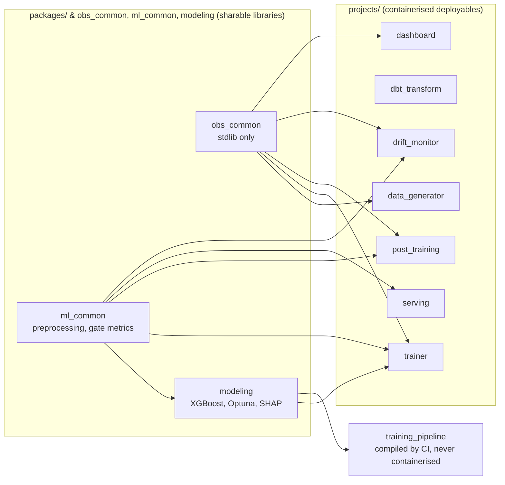

# Software Architecture & Monorepo Design

This repository is organized as a unified workspace powered by `uv`. Rather than allowing dependency bleed across the codebase, a strict separation of concerns is maintained between deployable applications and reusable code utilities.

## The Workspace Paradigm

The repository uses a single, global lockfile to guarantee complete reproducibility and version parity across all development, staging, and production environments. By defining independent project modules within a single workspace, the system enforces hard boundaries around individual execution contexts while still providing a local, direct method for consuming internal code libraries.

**Cross-project imports are opt-in, not automatic.** Sharing one workspace lockfile does not mean every container can import every other project's code. A project's source only becomes importable inside another project's container when both of the following are true: (1) the consuming project declares it as a dependency in its own `pyproject.toml`, and (2) the consuming project's `Dockerfile` explicitly `COPY`s that dependency's `pyproject.toml` and `src/` before running `uv sync --package <name>`. For example, `trainer/Dockerfile` copies in `ml-common` and `modeling` because `trainer` depends on both — but `serving`'s Dockerfile only copies `ml-common`, so `serving` cannot import `trainer` or `modeling` code even though they live in the same workspace. Each `Dockerfile` is therefore the actual enforcement point for import boundaries between deployables, not just a build-speed optimization.



Each arrow is a real `pyproject.toml` dependency, enforced at build time by the consuming project's Dockerfile as described above — `dbt_transform` depends on none of these packages, which is why it's the one container with no workspace-library edges into it. `dashboard` takes only `obs_common`: it reads a table the pipeline already wrote and never loads a model, so depending on `ml_common` would drag XGBoost and scikit-learn into an image that renders charts.

## Projects vs. Packages Philosophy

The codebase is explicitly divided into two structural domains:

* **Projects (Deployables):** Located within the `projects/` directory, these represent independent executables that contain a distinct runtime entry point, generate isolated container images or immutable templates, and target a specific cloud infrastructure destination. Each project specifies its own specialized operational requirements (e.g., FastAPI/Uvicorn for serving, or XGBoost/Optuna for training) without polluting neighboring microservices.
* **Packages (Sharables):** Located within the `packages/` directory, these represent internal libraries that compile code, shared utility methods, validation schemas, and database connectors. They are never executed independently but are instead declared as editable local workspace dependencies by the deployable projects. This configuration guarantees that data contracts and feature definitions remain identical between the training and serving boundaries.

---

## Repository Directory Layout

The workspace is organized to optimize Cloud Build caching mechanisms and preserve infrastructural clarity:

```text
.
├── .cloudbuild/                # Cloud Build pipeline definitions (one YAML per deployable)
│   └── data-gen.cloudbuild.yaml
├── .dockerignore               # Context exclusions for the five root-context image builds
├── .pre-commit-config.yaml     # Local lint/format gate (see cicd.md)
├── pyproject.toml              # Global workspace settings, Ruff config & single universal lock
├── uv.lock                     # Shared lockfile guaranteeing dependency parity
│
├── packages/                   # INTERNAL LIBRARIES (Sharable code blocks)
│   └── shared/                 # Common BQ connectors & feature schemas
│       ├── pyproject.toml
│       └── src/shared/
│
├── projects/                   # DEPLOYABLES (Executables with custom runtimes)
│   ├── data_generator/         # CDC Data Simulation Job
│   │   ├── Dockerfile
│   │   ├── pyproject.toml      # Dependencies: obs-common (workspace) + google-cloud-bigquery, numpy
│   │   ├── src/data_generator/
│   │   │   └── main.py         # Event generation loop → BigQuery streaming insert
│   │   └── tests/              # pytest unit + Testcontainers integration tests
│   │       ├── conftest.py
│   │       ├── test_config.py
│   │       ├── test_generate_event.py
│   │       ├── test_integration_bigquery.py
│   │       └── test_run.py
│   │
│   ├── dbt_transform/          # Feature Engineering Engine
│   │   ├── Dockerfile
│   │   ├── pyproject.toml      # Dependencies: dbt-core, dbt-bigquery
│   │   ├── dbt_project.yml     # Core dbt configuration
│   │   └── models/             # SQL transformation files
│   │
│   ├── training_pipeline/      # KFP pipeline definition (compile + stage only)
│   │   ├── pyproject.toml      # Dependencies: modeling (workspace) + kfp
│   │   └── src/training_pipeline/
│   │       ├── pipeline.py     # build_pipeline(), compile_pipeline() — never runs in a container
│   │       └── upload.py       # upload_pipeline() — pushes pipeline.yaml to the pipeline-templates KFP Artifact Registry repo
│   │
│   ├── obs_common/              # MLE-owned observability helpers (stdlib only, zero deps)
│   │   ├── pyproject.toml      # Dependencies: none — installed into every image
│   │   ├── src/obs_common/     # logging — Cloud Logging severity-correct log setup
│   │   └── tests/              # Unit tests runnable without GCP credentials
│   │
│   ├── ml_common/               # DS-owned inference logic (no GCP deps, no optuna/shap)
│   │   ├── pyproject.toml      # Dependencies: xgboost, sklearn, pandas, pyarrow, pydantic
│   │   └── src/ml_common/
│   │       ├── config.py       # MLSettings — model policy, overridable via ML_* env vars
│   │       ├── contracts/      # Pydantic models for every cross-container data schema
│   │       ├── preprocess.py   # Feature selection/dtypes, shared training <-> serving
│   │       ├── evaluate.py     # Champion/challenger gate metrics
│   │       ├── drift.py        # PSI baselines and comparison
│   │       └── data_quality.py # Snapshot assertions that gate retraining
│   │
│   ├── modeling/                # DS-owned training/HPO logic (no GCP dependencies)
│   │   ├── pyproject.toml      # Dependencies: ml-common (workspace) + optuna, shap
│   │   ├── src/modeling/       # train, hpo — pure Python/ML
│   │   └── tests/              # Unit tests runnable without GCP credentials
│   │
│   ├── trainer/                # MLE-owned heavy pipeline stages & GCP integration
│   │   ├── Dockerfile
│   │   ├── pyproject.toml      # Dependencies: modeling, ml-common, obs-common (workspace) + GCP client libs
│   │   └── src/trainer/
│   │       ├── data.py         # BigQuery → GCS Parquet export
│   │       ├── experiment.py   # Vertex AI Experiments logging wrapping hpo/train stages
│   │       └── main.py         # CLI dispatcher: data_split, hpo, train
│   │
│   ├── post_training/           # MLE-owned post-training champion/challenger gate
│   │   ├── Dockerfile
│   │   ├── pyproject.toml      # Dependencies: ml-common, obs-common (workspace) + GCP client libs
│   │   └── src/post_training/
│   │       ├── predict.py      # Model loading (shared by evaluate.py)
│   │       ├── evaluate.py     # Champion/challenger gate
│   │       ├── register.py     # Model Registry champion/challenger promotion
│   │       ├── notify.py       # Terminal outcome report (logging-only)
│   │       └── main.py         # CLI dispatcher: evaluate, register_or_reject, notify
│   │
│   ├── serving/                # MLE-owned production batch-prediction container
│   │   ├── Dockerfile
│   │   ├── pyproject.toml      # Dependencies: ml-common (workspace) + GCP storage, fastapi
│   │   └── src/serving/
│   │       ├── predict.py      # Model loading + scoring (shared by app.py)
│   │       ├── app.py          # FastAPI app: Vertex AI custom-container predict/health routes
│   │       └── serve.py        # Container entrypoint — starts the FastAPI server
│   │
│   └── dashboard/              # Business-user churn dashboard (Streamlit on Cloud Run)
│       ├── Dockerfile
│       ├── .streamlit/         # Presentation-only config; server flags live in serve.py
│       ├── pyproject.toml      # Dependencies: obs-common (workspace) + streamlit, BQ client
│       └── src/dashboard/
│           ├── settings.py     # Env-driven config: cost guards & risk bands
│           ├── data.py         # BigQuery reads under a hard byte ceiling
│           ├── risk.py         # Risk banding & cohort indicators (pure, no GCP)
│           ├── charts.py       # Altair builders + the validated colour palettes
│           ├── identity.py     # Reads the IAP-verified viewer email (display only)
│           ├── app.py          # The Streamlit page
│           └── serve.py        # Container entrypoint — starts the Streamlit server
│
├── notebooks/                  # Data scientist exploration notebooks (not deployed)
│   └── model_iteration.ipynb   # Local training loop: pull BQ data, run HPO, inspect SHAP
├── workflows/                  # Cloud Workflows YAML orchestration engine maps
└── iac/                        # Infrastructure as code (APIs, BigQuery, AR, Cloud Run, Cloud Build)
    ├── config/                 # One YAML file per resource domain
    │   ├── apis.yaml           # GCP APIs to enable
    │   ├── cloud_build.yaml    # GitHub connection + default Cloud Build SA roles
    │   ├── triggers.yaml       # Cloud Build trigger definitions
    │   ├── artifact_registry.yaml  # Artifact Registry repositories
    │   ├── gcs_buckets.yaml    # GCS bucket definitions
    │   ├── cloud_run_jobs.yaml # Cloud Run job definitions
    │   ├── cloud_run_services.yaml # Cloud Run service definitions (the dashboard)
    │   ├── workflows.yaml      # Cloud Workflows definitions
    │   └── bigquery.yaml       # BigQuery dataset and table definitions
    ├── locals.tf               # YAML decoding and resource flattening logic
    ├── main.tf                 # Module orchestration
    ├── terraform.tfvars        # Project-level provider variables (project_id, region)
    └── modules/
        ├── artifact_registry/  # Creates google_artifact_registry_repository resources
        ├── bq_dataset/         # Creates google_bigquery_dataset resources
        ├── bq_table/           # Creates google_bigquery_table resources
        ├── cloud_build/        # Creates Cloud Build v2 repo link, SA IAM bindings, and all triggers
        ├── cloud_run_job/      # Creates Cloud Run Job + dedicated service account + IAM bindings
        ├── cloud_run_service/  # Creates Cloud Run Service + service account + IAM bindings + IAP
        ├── cloud_workflow/     # Creates Cloud Workflows orchestrator definitions
        └── gcs_bucket/         # Creates google_storage_bucket resources + bucket-level IAM bindings
```

### Directory Descriptions

* **Workspace Root:** Houses the global package manager definitions, project boundaries, the universal environment lockfile, and the workspace-wide Ruff configuration — deliberately declared once here rather than per package, so lint rules cannot drift between components. See [cicd.md](cicd.md#pre-commit-hooks).
* **Cloud Build Directory (`.cloudbuild/`):** One YAML file per deployable, each defining the build → push → deploy pipeline for that service. Triggers are declared in `iac/config/triggers.yaml` and provisioned via Terraform; the YAML files only contain steps.
* **Packages Directory (`packages/shared/`):** Contains internal libraries, structured data validation schemas, feature manifests, and BigQuery communication layers shared across runtimes.
* **Projects Directory (`projects/`):**
  * `data_generator/`: The CDC simulation module. Executes as an ephemeral Cloud Run job to append synthetic events to BigQuery, mimicking an upstream transactional database feed. Each invocation streams a configurable batch of events (`BATCH_SIZE`, default 2000) drawn from a fixed user pool, with realistic churn-correlated signals. Structural anomalies can be injected at a configurable rate (`ANOMALY_RATE`) to test downstream drift detection. Runtime targets are injected via env vars: `BQ_PROJECT_ID`, `BQ_DATASET_ID`, `BQ_TABLE_ID`.
  * `dbt_transform/`: The feature engineering engine. Contains the dbt project configuration, SQL models, and dependencies required to transform raw CDC telemetry into structured, ML-ready feature matrices.
  * `training_pipeline/`: The KFP pipeline definition package. Contains `build_pipeline()` and `compile_pipeline()` — used by Cloud Build to compile the six-stage training DAG into a Vertex AI Pipelines YAML, and `upload_pipeline()` to push that template into the `pipeline-templates` Artifact Registry repo via `kfp.registry.RegistryClient`. This package is never containerised; it installs only `kfp` and `modeling` (for HPO defaults). It has its own dedicated `training-pipeline-trigger`, decoupled from the trainer/post-training/serving image builds, so pipeline-structure-only changes don't force a container rebuild.
  * `obs_common/`: The MLE-owned observability package. Contains `configure_logging()`, the Cloud Logging-aware replacement for `logging.basicConfig` that every container entrypoint calls at startup — see [observability.md](observability.md#log-severity). Deliberately stdlib-only: it is the one package installed into *every* image, including `data_generator`, which carries no ML or GCP libraries beyond the BigQuery client, so any dependency added here would land in all of them.
  * `ml_common/`: The DS-owned inference logic package. Contains feature preprocessing, the champion/challenger metrics gate, PSI drift, the data-quality assertions, and — in `contracts/` and `config.py` — the data schemas and model policy every other package shares. Pure Python, no GCP dependencies, and critically no Optuna/SHAP. Shared by `modeling` (training), `post_training` (the champion/challenger gate), `drift_monitor`, `trainer` and `serving` (batch prediction), so none of those containers install training-only dependencies. See [Data Contracts & Configuration](#data-contracts--configuration).
  * `modeling/`: The DS-owned training/HPO package. Contains XGBoost training and Optuna HPO, depending on `ml_common` for preprocessing — pure Python with no GCP dependencies. Unit-testable without cloud credentials.
  * `trainer/`: The MLE-owned heavy pipeline wrapper. Imports `modeling`/`ml_common` as workspace dependencies and adds GCP I/O for the `data_split`/`hpo`/`train` stages: BigQuery → GCS Parquet export and Vertex AI Experiments logging. Produces the trainer container image.
  * `post_training/`: The MLE-owned post-training pipeline stage container. Imports `ml_common` only (no Optuna/SHAP) and adds GCP I/O for the `evaluate`/`register_or_reject`/`notify` CLI stages: the champion/challenger gate, Vertex AI Model Registry promotion, and the terminal outcome report (logging-only — see [observability.md](observability.md)). This container never serves live predictions — it only runs as one-shot KFP pipeline steps, each invoking a different CLI subcommand.
  * `serving/`: The MLE-owned production batch-prediction container. Imports `ml_common` only (no Optuna/SHAP) and exposes a FastAPI app (`app.py`) implementing Vertex AI's custom-container prediction contract (`/predict`, `/health`), used by Vertex AI `BatchPredictionJob` to score the daily feature snapshot. Distinct from `post-training`: this image never runs pipeline stages, it only ever serves predictions.
  * `dashboard/`: The business-user surface, and the only deployable in this repo that serves a human rather than the pipeline. A Streamlit app on a Cloud Run **service** (not a Job), fronted by Identity-Aware Proxy, reading two dbt views that join predictions back to the features a retention owner can act on. It imports `obs_common` only — no model is ever loaded here. Its design constraints are unlike every other component's: it must never present a prediction as an observation, never call a cohort contrast a model explanation, and never let a stale snapshot look like a quiet week. See [dashboard.md](dashboard.md).
* **Workflows Directory (`workflows/`):** Contains the state-machine logic maps for the cloud orchestrator, detailing execution steps, retry policies, and failure notification boundaries.
* **IaC Directory (`iac/`):** Houses the declarative infrastructure code required to bootstrap and manage the GCP environment. See [iac.md](iac.md) for full details.

---

## Data Contracts & Configuration

Two concerns that look alike and are deliberately kept apart: the **shape** data has to have, and the **values** a deployment gets to choose.

### Contracts — `ml_common/contracts/`

Every schema that crosses a process, container, or storage boundary is a Pydantic model declared once in `ml_common.contracts`, and validated at the boundary it crosses. In-process values — DataFrames, numpy arrays, the hyperparameter dict handed straight to XGBoost — are deliberately left alone: validating those costs readability and buys nothing.

| Contract | Written by | Read by |
|----------|-----------|---------|
| `ModelMetadata` (`metadata.json`) | `trainer.experiment` | `serving.app`, `post_training.evaluate`/`fetch_champion`, `drift_monitor.detect`, `scripts/rebuild_champion_baseline.py` |
| `BaselineSpec` (categorical / discrete / numeric, discriminated on `type`) | `ml_common.drift.compute_baseline_stats` | `ml_common.drift`, `ml_common.data_quality` |
| `SplitRef` | `trainer.data.export_snapshot` | `trainer.data.read_split`, `post_training.bigquery`/`batch_predict` |
| `EvaluationMetrics`, `PromotionDecision` | `post_training.evaluate` | `post_training.register` |
| `RegistrationResult`, `RejectionState` | `post_training.register` | `post_training.notify`, the next run's rejection counter |
| `PredictRequest`/`PredictResponse`, `ChurnPrediction` | `serving.app` | Vertex AI Batch Prediction, then `post_training.evaluate` via `BatchPredictionRecord` |
| `DriftDecision` (`drift/latest.json`) | `drift_monitor.detect` | The Cloud Workflows orchestrator |
| `DriftMetricRow` | `drift_monitor.history` | `ml.drift_metrics`, read back by the persistence rule |
| `ActivityCdcRow` (`data_generator.schema`) | `data_generator.main` | `raw.activity_cdc`, then dbt |
| `ChurnRiskRow`, `ChurnRiskDailyRow` (`dashboard.schema`) | the dbt marts | `dashboard.data`, checked on every fetch |

Three properties make these safe to evolve rather than merely strict:

* **Tolerant reading.** `ModelMetadata` and the baseline specs use `extra="allow"` and mark as optional every field added after a champion could have been registered. A model serving today may predate a field, and its artifact cannot be rewritten without retraining it or running `scripts/rebuild_champion_baseline.py`. *Absent* means something specific in each case — see the module docstring in `contracts/baseline.py`.
* **Absent stays absent.** Contracts are serialised through `contracts.to_json`, which excludes unset fields. Both these readers and the orchestrator workflow test for key *presence* to detect a legacy artifact or an optional section, so writing an explicit `null` would read as "present, and false-y" and take the wrong branch.
* **Infinities survive.** `to_json` uses `json.dumps` over a Python-mode dump rather than `model_dump_json`, because Pydantic's JSON encoder writes non-finite floats as `null` by default and decile bin edges are bounded by ±inf on purpose. Rewriting those two edges would make every rebuilt baseline unreadable.

The contracts also own the field-name constants (`CHURN_PROBABILITY_FIELD`, `CHURN_PREDICTION_FIELD`) that appear as BigQuery column names and as string literals in SQL — a test pins them to the model's own field names so a rename cannot desync them.

**A contract that validates a BigQuery-derived DataFrame must normalise NULL first.** A BigQuery NULL does not survive `to_dataframe()` as `None`, and it does not arrive as one thing: `INT64` and `BOOL` columns come back as pandas extension dtypes carrying `pd.NA` (the client's `int_dtype`/`bool_dtype` defaults), while `FLOAT64` columns come back as numpy `float64` carrying `NaN` — so a single read yields both spellings. `NaN` is the dangerous one: it passes an `is not None` check and then fails every bound, so a legitimately NULL value is reported as *out of range* rather than as *absent*. `dashboard.schema` handles this with a `BeforeValidator` on every optional field; copy that pattern rather than rediscovering it.

This applies only to contracts over DataFrames. Every other contract here is validated over JSON — GCS artifacts, KFP artifact files, Batch Prediction JSONL — where a null really is `None`. And the ML path itself needs no normalisation: `drift`, `data_quality` and `preprocess` go through `.isna()`, `dropna()` and `pd.to_numeric()`, which are agnostic to which spelling they get. Forcing one representation at the read instead would mean pushing pandas extension dtypes onto the training and serving frames, which `trainer.data.read_split` deliberately moved *away* from — so the normalisation belongs at the validation boundary, not at the query.

`dashboard` is the one package that declares its contracts locally rather than importing them. It never loads a model or scores anything, so depending on `ml-common` would pull xgboost and scikit-learn into an image that renders charts; its models describe the dbt marts it reads, which are owned by dbt rather than by the serving container, and a test asserts them against the mart SQL. See [dashboard.md](dashboard.md#the-contract-with-those-views).

### Configuration — settings, not constants

Tunable values are `pydantic-settings` classes read from the environment, split by who owns them:

| Settings class | Env prefix | Scope |
|----------------|-----------|-------|
| `ml_common.config.MLSettings` | `ML_` | Promotion gate, target recall, split, data-quality tolerances, table names |
| `modeling.config.ModelingSettings` | `MODELING_` | HPO budget, search space, fixed XGBoost params |
| `drift_monitor.config.DriftMonitorSettings` | — | The drift job's GCP targets and detection policy |
| `serving.settings.Settings` | — | Vertex's `AIP_*` contract, plus `THRESHOLD`/`PROJECT_ID` |
| `data_generator.config.Settings` | `BQ_` (destination only) | BigQuery destination and simulation scale |
| `dashboard.settings.DashboardSettings` | — | The dashboard's BigQuery targets, cost guards and risk bands |

The split that matters is **defaulted vs. required**:

* **Model policy is fully defaulted.** `MLSettings` and `ModelingSettings` have a working default for every field, because the training pipeline is *compiled* on a laptop and on Cloud Build, where none of these variables are set — a required field there would break the build rather than the run.
* **Infrastructure identity is required.** Project, region, bucket and route names have no defaults, so a missing variable fails the container at startup where Cloud Run or Vertex reports it. This replaced `os.environ.get()` reads annotated `str`: a missing variable produced `None`, and the drift job ran to completion against `gs://None-None/None` — a silent no-op that looked like a healthy night.

Settings are reached through a `get_settings()` accessor cached with `lru_cache`, so a container's configuration is read once and cannot disagree with itself mid-run; tests call `get_settings.cache_clear()` or pass an explicit settings object to the functions that accept one.

**How a value reaches production** depends on where the code runs:

* **Cloud Run jobs** (`data-gen`, `drift-monitor`) read their environment directly — `env_vars` in `iac/config/cloud_run_jobs.yaml`. Changing one is a `terraform apply`.
* **Cloud Run services** (`dashboard`) work identically, from `iac/config/cloud_run_services.yaml`.
* **Vertex AI Pipelines containers** have no Terraform of their own; the pipeline spec is their deployment descriptor. `training_pipeline.settings_env` therefore pins the resolved `ML_*`/`MODELING_*` values onto every task's container at compile time, sourced from the compile step's environment, which Cloud Build fills from `training-pipeline-trigger.substitutions` in `iac/config/triggers.yaml`. That both lets a deployment retune the platform without a code change and records the policy each run was judged by in the pipeline spec itself.
* **The serving container** receives `THRESHOLD` and `PROJECT_ID` on the registered model's container spec, set by `post_training.register` at promotion time — so every batch prediction against a model version applies the threshold that version was actually evaluated with.

---

## Naming Conventions

### GCP Resource Names

All GCP resources follow a two-token pattern:

```
{component}-{type}
```

The component comes first so that alphabetically sorted resource lists (e.g. Cloud Run Jobs page, IAM list) cluster all resources belonging to the same functional area together.

#### Component slugs

| Component | Slug | Functional area |
|---|---|---|
| Data generation | `data-gen` | CDC simulator |
| dbt transformations | `dbt` | Cloud Run dbt container |
| ML training | `trainer` | Vertex AI training jobs |
| Hyperparameter optimisation | `hpo` | Vertex AI HPO |
| Model evaluation, registration, outcome report | `post-training` | Champion/challenger gate, Vertex AI Model Registry, Cloud Logging |
| Batch prediction | `serving` | Vertex AI BatchPredictionJob |
| Drift detection | `drift` | Observability & alerting |
| Orchestration | `orchestrator` | Cloud Workflows |
| Business dashboard | `dashboard` | Streamlit on Cloud Run, behind IAP |

#### Resource type suffixes

| GCP resource | Suffix | Example |
|---|---|---|
| Service Account | `-sa` | `data-gen-job-sa` |
| Cloud Run Job | `-job` | `data-gen-job` |
| Cloud Build Trigger | `-trigger` | `data-gen-trigger` |
| Cloud Workflow | `-workflow` | `orchestrator-workflow` |
| Vertex AI Pipeline | `-pipeline` | `trainer-pipeline` |

> **Service accounts** are auto-derived from the Cloud Run Job name by the `cloud_run_job` Terraform module as `{job_name}-sa`. A job named `data-gen-job` therefore produces a service account `data-gen-job-sa`.

#### Cloud Build GitHub connection

The Cloud Build v2 GitHub connection (`customer-churn-connection`) is exempt from the component naming convention. It is a one-time platform prerequisite created manually via the GCP Console (requires OAuth authorization) and is only referenced by name in Terraform — not managed by it. Do not rename it.

### BigQuery Names

BigQuery identifiers must use underscores (hyphens are not allowed).

**Datasets** are named after their layer:

| Dataset | Purpose |
|---|---|
| `raw` | Raw CDC event ingestion |
| `features` | Engineered ML feature matrices |
| `ml` | Model metadata, predictions, evaluation |

**Tables** use a short descriptive name within their dataset context — no dataset prefix is repeated. Example: `activity_cdc` inside `raw`, not `raw_activity_cdc`.

### Cloud Build YAML Files

One file per deployable, named after its component slug:

```
.cloudbuild/{component}.cloudbuild.yaml
```

Example: `.cloudbuild/data-gen.cloudbuild.yaml`

### Source Code Directories (`projects/`)

Directory names in `projects/` are Python package names and follow PEP 8 (lowercase, underscores). They do **not** carry a type suffix — the `projects/` context already implies "deployable". These names are intentionally decoupled from GCP resource names.

| Directory | GCP resource |
|---|---|
| `projects/data_generator/` | `data-gen-job` Cloud Run Job |
| `projects/dbt_transform/` | `dbt-job` Cloud Run Job |
| `projects/modeling/` | No GCP resource — consumed as a library by `trainer` and `training_pipeline` |
| `projects/trainer/` | Trainer container image pushed to Artifact Registry |
| `projects/training_pipeline/` | KFP compilation step — no persistent GCP resource, not containerised |
| `projects/post_training/` | Post-training container image pushed to Artifact Registry — runs as KFP pipeline steps only |
| `projects/serving/` | Vertex AI Endpoint / serving container |
