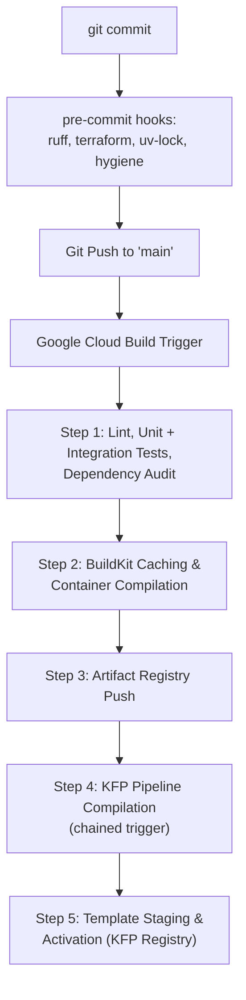

# CI/CD Deployment Blueprint (Google Cloud Build)

The continuous integration and continuous delivery engine is completely driven by **Google Cloud Build**. Triggered automatically by repository events—such as pull requests or direct merges into the primary `main` branch—Cloud Build runs isolated, rapid steps leveraging GCP's secure infrastructure network.



## Pre-Commit Hooks

Cloud Build is the authority on whether a change is deployable, but it is a slow way to learn about a missing docstring. A local `pre-commit` gate catches the mechanical class of failure — formatting, import order, dead code, unparseable YAML, an unformatted Terraform module, a stale lockfile — before a commit is ever created. Configuration lives in [`.pre-commit-config.yaml`](../.pre-commit-config.yaml) with every hook revision pinned; `pre-commit autoupdate` bumps them deliberately rather than silently.

| Hook | Scope | What it enforces |
|------|-------|------------------|
| `trailing-whitespace`, `end-of-file-fixer`, `mixed-line-ending` | all text files | Whitespace hygiene; LF endings |
| `check-yaml`, `check-toml`, `check-json` | `*.yaml`, `*.toml`, `*.json` | Syntactic validity — catches a malformed `iac/config/*.yaml` or `.cloudbuild/*.yaml` before Terraform or Cloud Build reads it |
| `check-added-large-files` | newly added files | Blocks anything over 512 KB |
| `detect-private-key` | all files | Keeps service-account keys out of history |
| `check-merge-conflict`, `check-case-conflict` | all files | Unresolved conflict markers; names that collide on case-insensitive filesystems |
| `ruff-check --fix` | `*.py`, `*.ipynb` | Lint + autofix (see rules below) |
| `ruff-format` | `*.py` | Formatting, 100-column lines |
| `uv-lock` | workspace manifests | Re-locks when a `pyproject.toml` changes, so `uv sync --frozen` in the Dockerfiles never fails on a stale `uv.lock` |
| `terraform_fmt` | `iac/**/*.tf` | Canonical HCL formatting |
| `terraform_validate` | `iac/**` | Validates each module with `-backend=false`, so it never touches or locks state |

### Ruff Configuration

All Ruff settings live in the `[tool.ruff]` tables of the root [`pyproject.toml`](../pyproject.toml). No sub-package declares its own `[tool.ruff]` table, so Ruff resolves every file in the workspace against that single config — lint rules cannot drift between packages.

Enabled rule families: `F` (pyflakes), `E`/`W` (pycodestyle), `I` (import sorting), `UP` (pyupgrade), `B` (bugbear), `SIM` (simplify), `D` (pydocstyle, Google convention — this is what mechanically enforces the docstring rule in `CLAUDE.md`), and `RUF`. `target-version` is pinned to `py312`, the floor of every package's `requires-python`.

Two deliberate carve-outs:

* **`**/tests/**` skips the `D1` missing-docstring rules.** A test's name is its documentation; requiring a docstring on each one adds noise without information. Every other rule still applies to test code.
* **`notebooks/**` is linted but never formatted**, and is exempt from `D` and `E501`. Cell-level reformatting produces unreadable diffs on exploratory work. The format exclusion is set in `[tool.ruff.format]` rather than in the hook definition, so a manual `ruff format` behaves identically to the hook.

Notebook outputs are intentionally **not** stripped — there is no `nbstripout` hook. The committed plots and tables under `notebooks/` are the record of the feature-selection decisions that [feature-exploration.md](feature-exploration.md) refers back to; stripping them would delete documentation. `check-added-large-files` is the guard against those files growing without bound.

### Running Manually

```sh
pre-commit run --all-files          # full sweep — the state CI expects
pre-commit run ruff-check --all-files   # a single hook
git commit --no-verify              # escape hatch; Cloud Build will still run the tests
```

---

## Lint, Integration Tests & Dependency Audit

Pre-commit hooks (ruff, terraform, uv-lock) only run locally and are trivially bypassed with `git commit --no-verify` — Cloud Build is the actual, unbypassable gate, so every Python `.cloudbuild/*.yaml` file re-runs the checks that matter as blocking steps, in addition to the unit `test` step:

* **`lint`** runs `uvx ruff@${_RUFF_VERSION} check` and `ruff format --check` against that component's own directory (or directories, for `trainer.cloudbuild.yaml`, which covers `ml_common`, `modeling`, and `trainer` in one step). `_RUFF_VERSION` is a substitution pinned to the same rev as the `ruff-pre-commit` hook in [`.pre-commit-config.yaml`](../.pre-commit-config.yaml), so a local `pre-commit run` and this CI gate never disagree about what counts as a lint failure. `uvx` (not a `pyproject.toml` dev dependency) is used because ruff isn't part of any workspace member's own dependency graph — this mirrors how the pre-commit hook manages its own isolated ruff install.
* **`integration-test`** runs `pytest -m integration` for the components that have real integration tests: `data_generator`, `serving`, `post_training`, and `trainer`. These spin up real service emulators via [Testcontainers](https://testcontainers.com/) — `ghcr.io/goccy/bigquery-emulator` and `fsouza/fake-gcs-server` — as sibling containers. This works without extra Cloud Build configuration because Cloud Build mounts `/var/run/docker.sock` into every build step by default, so `testcontainers` can talk to the host's Docker daemon the same way the `gcr.io/cloud-builders/docker` build/push steps do.

  **Known emulator limitation:** `ghcr.io/goccy/bigquery-emulator` (verified through v0.8.1, the newest release as of this writing) crashes with an internal WASM panic (`wasm trap: invalid memory address or nil pointer dereference`) on *any* table operation — `tables.insert` or a `CREATE TABLE` DDL query — inside a dataset literally named `ml`. That's not an edge case here: `SPLIT_ASSIGNMENTS_TABLE = "ml.split_assignments"` in [`ml_common/config.py`](../projects/ml_common/src/ml_common/config.py) is the dataset every retraining/evaluation run reads and writes. Real BigQuery has no such restriction — `ml` isn't a reserved dataset name — so this is purely an emulator bug, not a signal to rename the dataset. Practically, it means `post_training.bigquery.read_split`, `post_training.batch_predict.create_batch_source_files`, and `trainer.data.export_snapshot`/`read_split` cannot be integration-tested locally; only their GCS-touching siblings (`post_training.storage`, the GCS half of `trainer.data`) and `serving.storage` have real emulator-backed coverage. The `ml.split_assignments`-touching functions remain covered by unit-level mocks only, the same ceiling that already applies to the Vertex AI Model Registry/Experiments code in `post_training.register`/`fetch_champion` and `trainer.experiment` (no local emulator exists for those either).
* **`audit`** runs `uv run --frozen --extra dev --with pip-audit pip-audit` (or without `--extra dev` for `dbt_transform`, which has no dev extra) — an ephemeral `pip-audit` install audits the exact synced environment the `test` step just ran in, and fails the build on a known CVE in a resolved dependency. This is deliberately separate from [GitHub Dependabot](https://docs.github.com/en/code-security/dependabot) (configured in [`.github/dependabot.yml`](../.github/dependabot.yml)): Dependabot alerts are a GitHub-side signal, not a Cloud Build gate, and Dependabot's `uv` support currently covers *version updates* to `uv.lock`, not vulnerability *scanning* of it — so `pip-audit` is what actually blocks a build here, while Dependabot alerts remain the mechanism for the proactive `constraint-dependencies` version floors documented in each `pyproject.toml`. GCP's Artifact Registry On-Demand Scanning API (`gcloud artifacts docker images scan`) would add OS-package-level coverage of the final built image, but is metered per image scanned — it's deliberately not enabled here to keep this gate free; revisit if OS-level image scanning becomes a requirement.

---

## Triggers

Cloud Build triggers fire on pushes to `main`, each scoped to its own file paths:

| Trigger | Watched paths | Build config |
|---------|--------------|--------------|
| `data-gen-trigger` | `projects/obs_common/**`, `projects/data_generator/**`, `pyproject.toml`, `uv.lock` | `.cloudbuild/data-gen.cloudbuild.yaml` |
| `dbt-trigger` | `projects/dbt_transform/**` | `.cloudbuild/dbt.cloudbuild.yaml` |
| `workflow-trigger` | `workflows/**` | `.cloudbuild/workflow.cloudbuild.yaml` |
| `trainer-trigger` | `projects/obs_common/**`, `projects/ml_common/**`, `projects/modeling/**`, `projects/trainer/**`, `pyproject.toml`, `uv.lock` | `.cloudbuild/trainer.cloudbuild.yaml` |
| `post-training-trigger` | `projects/obs_common/**`, `projects/ml_common/**`, `projects/post_training/**`, `pyproject.toml`, `uv.lock` | `.cloudbuild/post-training.cloudbuild.yaml` |
| `serving-trigger` | `projects/ml_common/**`, `projects/serving/**`, `pyproject.toml`, `uv.lock` | `.cloudbuild/serving.cloudbuild.yaml` |
| `training-pipeline-trigger` | `projects/training_pipeline/**` | `.cloudbuild/training-pipeline.cloudbuild.yaml` |
| `drift-monitor-trigger` | `projects/obs_common/**`, `projects/ml_common/**`, `projects/drift_monitor/**`, `pyproject.toml`, `uv.lock` | `.cloudbuild/drift-monitor.cloudbuild.yaml` |

The workflow trigger runs a single `gcloud workflows deploy` step — no container build involved. It requires the Cloud Build SA to hold `roles/workflows.editor`.

## Dependency Version Pinning

The `uv` and Python versions are each pinned once as Cloud Build substitution variables in `cloudbuild.yaml` and passed as Docker build args to every `docker build` step:

```yaml
# cloudbuild.yaml (substitutions block)
substitutions:
  _UV_VERSION: "0.11.19"
  _PYTHON_VERSION: "3.13"

# per build step
args:
  - build
  - --build-arg=UV_VERSION=${_UV_VERSION}
  - --build-arg=PYTHON_VERSION=${_PYTHON_VERSION}
  - ...
```

Each Dockerfile receives them via:

```dockerfile
ARG UV_VERSION
ARG PYTHON_VERSION

FROM ghcr.io/astral-sh/uv:${UV_VERSION}-python${PYTHON_VERSION}-trixie-slim AS builder
...
FROM python:${PYTHON_VERSION}-slim-trixie
```

This ensures training, post-training, serving, and pipeline containers always resolve dependencies with the same `uv` and Python versions. To upgrade either, change the relevant variable in one place.

Every component Dockerfile is a two-stage build: the `builder` stage uses the `uv` image to resolve the lockfile into a `.venv`, and the final stage copies only that `.venv` into a plain `python:${PYTHON_VERSION}-slim-trixie` base — pinned to the same Debian release as the builder so copied C-extension wheels (numpy, pandas, xgboost, etc.) remain glibc-compatible. This keeps `uv` itself and any build toolchain out of the shipped image, reducing both image size and attack surface. The final stage also drops root, running as a dedicated non-root `appuser` (uid/gid 1000).

### Build Contexts

Five images (`trainer`, `post-training`, `serving`, `drift-monitor`, `data-gen`) build with the repository root as their context, because each consumes workspace packages that live outside its own directory. Their Dockerfiles still `COPY` an explicit allowlist — the root manifest and lockfile, plus the `pyproject.toml` and `src/` of each declared dependency — so the wide context grants no extra import reach (see [architecture.md](architecture.md#the-workspace-paradigm)).

A root [`.dockerignore`](../.dockerignore) keeps that context from carrying the whole monorepo to the builder: local `.venv/` directories, `.git/`, Python and coverage caches, test suites, `iac/` (whose `.terraform/` vendors hundreds of megabytes of provider binaries, and whose local state may hold secrets), and the output-bearing `notebooks/`. The `dbt` image is the one exception — it builds from `projects/dbt_transform/` and Docker only reads the `.dockerignore` at the context root, so that directory carries [its own](../projects/dbt_transform/.dockerignore) covering dbt's `target/`, `dbt_packages/` and `logs/`.

## Pipeline Steps

1. **Workspace Isolation Testing:** Cloud Build provisions a secure runner, loads the centralized `uv` caching layer, and validates code integrity. For Python projects this runs `uv run pytest`; for the dbt transformation project it runs `dbt parse` (which validates all SQL model syntax and Jinja references without a database connection). This step ensures that modifications inside any component do not introduce structural regressions before a container is built. Every Python `.cloudbuild/*.yaml` file also runs a `lint` step and an `audit` step ahead of (or alongside) `test` — see **Lint, Integration Tests & Dependency Audit** below — so a build fails fast on a formatting issue, a known CVE, or a real test regression before any Docker layer is built.

2. **High-Performance Container Compilation:** When changes are merged into the `main` branch, Cloud Build isolates the build boundary. Utilizing native Docker BuildKit cache mounts, the engine reuses pre-compiled layers for workspace environments. It packages the isolated requirements for the custom training and serving runtime environments, outputting lean, deterministic, production-ready images.

3. **Secure Artifact Staging:** Compiled container runtimes are automatically tagged with immutable version identifiers and pushed into a private, secure Google Artifact Registry repository.

4. **Programmatic Pipeline Compilation:** `training-pipeline-trigger` fires two ways: directly, when `projects/training_pipeline/**` changes, or chained, as the final `trigger-pipeline-compile` step of `trainer-trigger`, `post-training-trigger`, and `serving-trigger` (`gcloud builds triggers run training-pipeline-trigger`). Because Cloud Build steps run sequentially and stop on first failure, that chaining step is only reached after a component's `test` → `build` → `push` steps all succeed — a broken image build never triggers a pipeline recompile. This is one-directional decoupling: editing the pipeline doesn't rebuild/push an unchanged image, but a verified trainer/post-training/serving rebuild does trigger a recompile.

   The compile build first runs a `resolve-digests` step that looks up the current digest behind each `trainer:latest`/`post-training:latest`/`serving:latest` tag via `gcloud artifacts docker images describe` and writes `repo@sha256:...` references to the workspace. The `compile-pipeline` step then runs `uv run --package training-pipeline python -m training_pipeline.pipeline` against those pinned digests (not the moving `:latest` tag) to compile the Python-defined KFP graph into a declarative template (`pipeline.yaml`). Pinning to a digest at compile time — rather than letting each pipeline step resolve `:latest` independently at pull time — guarantees every stage of a given pipeline run uses the exact same image, even if someone pushes a new `:latest` mid-run. `training-pipeline` is never containerised — this step runs the package directly in a `uv` build runner.

5. **Template Staging & Activation:** The `stage-pipeline` step uploads the compiled `pipeline.yaml` to the `pipeline-templates` Artifact Registry repository (`KFP` format, see [iac.md](iac.md)) via `kfp.registry.RegistryClient`, tagging it `latest`. This gives the template registry versioning and content addressing instead of a flat file, and makes it instantly referenceable for automated execution by Cloud Workflows during scheduled periods or drift-remediation retraining events.

Cloud Build's job for `serving-trigger` ends at pushing the `serving:latest` image and triggering the pipeline recompile above — there is no Cloud Run (or any) deployment step, because serving isn't a standing service. The serving image only becomes "live" later, at pipeline runtime: the `register_or_reject` post-training stage bakes its registry path into a Vertex AI `Model` resource (`serving_container_image_uri`) when a challenger is promoted, and `orchestrator-workflow` boots that container on demand via a daily `BatchPredictionJob`, not an always-on endpoint. See [ml-infrastructure.md](ml-infrastructure.md#dependency-alignment-between-training-evaluation-and-serving) for how the container is wired into that Model resource.
