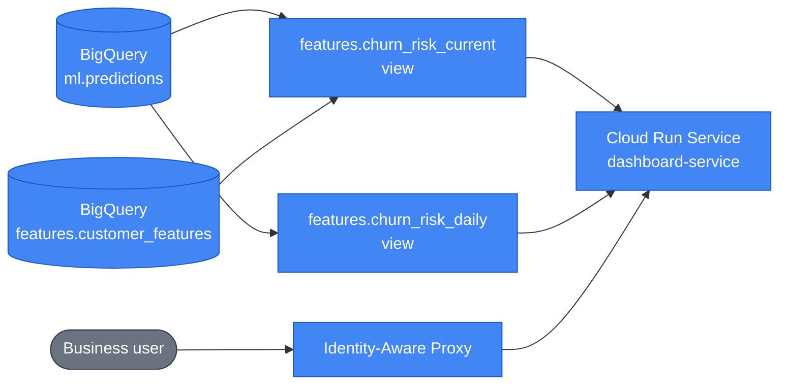

# Churn Dashboard (business-user surface)

Every other component in this platform is read by engineers. This one is read by whoever owns
retention, and that single fact drives most of the decisions below — what it shows, what it
refuses to show, how it is secured, and why it costs nothing to run.

It is a Streamlit app on a Cloud Run **service** (not a Job — this is the only long-running
process in the repo), fronted by Identity-Aware Proxy, reading two dbt views.



---

## What it shows

| Section | Question it answers |
|---|---|
| KPI row | How many customers were scored, how many are high risk, what monthly value that group carries |
| Band composition | What share of the base falls in each risk band |
| Risk by segment | Where risk concentrates — by membership tier, region or channel |
| Churn-rate trend | Whether the at-risk population is growing or shrinking |
| Retention worklist | Which specific customers to contact, ranked, filterable, searchable |
| Indicator panel | What makes one selected customer unusual relative to the cohort |

### Three things it deliberately does not do

**It never presents a prediction as an observation.** `churn_risk_current` drops the `churned`
label that `customer_features` carries. Putting an observed outcome in the same table as a
predicted probability invites reading the two as the same kind of fact, and a business reader
has no reason to know they are not. A headless render test asserts the column stays out.

**It never calls a cohort contrast a model explanation.** The indicator panel compares a
customer against everyone scored the same night — payment failures 3× the cohort median,
engagement a third of it. Those are *correlates*. The model's actual attribution for that
customer would be a SHAP value computed at scoring time, and the serving container returns a
probability and nothing else. Every label in that panel says "indicator", and the panel states
the distinction in text. Extending `ml.predictions` to carry per-customer SHAP is the change
that would let it say "why"; until then it does not claim to.

**It never lets stale data look like good news.** A scoring pipeline that silently stopped
produces a page that reads exactly like a quiet week. The snapshot date and its age sit in
the header, and anything older than the nightly cadence raises a banner explaining that this
is a historical view. This is the single most important thing on the page.

---

## Why it is free

Two decisions, and the whole cost story is in them.

**One query per cache window, not one per interaction.** Both views are scoped in SQL —
`churn_risk_current` to a single snapshot partition, `churn_risk_daily` to narrow aggregate
columns over a table it never joins. The app pulls each *in full* into pandas once, caches it
for `CACHE_TTL_SECONDS` (default 30 min), and runs every filter, sort, search and drill-down
against that in-memory frame. Pushing filters down to BigQuery instead would make a user
dragging a slider a billable event. Under this design a day of heavy use is a handful of
queries over a few MB, against BigQuery's 1 TiB/month free allowance.

`MAX_BYTES_BILLED` (default 2 GiB) sits underneath as a hard ceiling BigQuery itself enforces:
a query projected to exceed it is rejected before it runs. It is the backstop for the case
where someone rewrites a view into a full-history scan — it turns a surprise bill into a
visible error.

**Scale to zero.** `min_instance_count = 0`. Cloud Run's always-free allowance is 180k
vCPU-seconds a month; one instance pinned warm for a 730-hour month is roughly 2.6M, so
`min_instances = 1` would leave the free tier by about 15×. The cost is a cold start on the
first request of the day, which `startup_cpu_boost` absorbs. `max_instances = 3` caps a
runaway.

`cpu_idle = false` is not negotiable in the other direction: Streamlit serves each session
over a long-lived WebSocket from a per-process cache, so throttling CPU between requests would
stall the session.

---

## Authentication

IAP is enabled **directly on the Cloud Run service** — `iap_enabled = true` on
`google_cloud_run_v2_service`. This integration is GA and needs no load balancer, which is
what makes production-grade auth free here: the older IAP-on-Cloud-Run topology required an
external Application Load Balancer, forwarding rule and static IP, none of which have a free
tier.

The authorisation boundary is IAM, not the network:

* The service's ingress is open (the direct IAP integration requires it — IAP fronts the
  `run.app` URL itself).
* Invoking it requires `roles/run.invoker`, and the **only** principal holding it is IAP's
  service agent, `service-<PROJECT_NUMBER>@gcp-sa-iap.iam.gserviceaccount.com`.
* Business users are granted `roles/iap.httpsResourceAccessor`, from the `dashboard_viewers`
  Terraform variable. It defaults to `[]`, so the service deploys reachable by nobody — the
  right state to fail into for a page showing customer-level data.

Set it to a **group**, not a list of people, so joiners and leavers are a group membership
change rather than a Terraform apply:

```hcl
# iac/terraform.tfvars
dashboard_viewers = ["group:retention-team@example.com"]
```

### The OAuth client (and why one step stays manual)

IAP needs an OAuth client to run its sign-in flow. Where that client comes from depends on
something outside this repository:

* **Project in a Cloud organization** — IAP uses its own Google-managed client. Nothing to
  configure; `iap_enabled = true` is the whole story.
* **Standalone project (no organization)** — the managed client is unavailable. It admits
  only "users within the organization in which the resource is contained", and there is no
  such set, so IAP has no client and *every* request returns `502 — Empty Google Account
  OAuth client ID(s)/secret(s)`. A custom client is required.

That custom client has to be created by hand. It is the one part of this component that
Terraform cannot own, and not by choice: the IAP OAuth Admin APIs — `google_iap_brand`,
`google_iap_client`, `gcloud iap oauth-brands` — were permanently shut down in March 2026,
and they refused projects without an organization even while they existed. The console's
OAuth consent screen is the only remaining path.

Terraform still owns the *attachment*: `google_iap_settings` in the `cloud_run_service`
module writes the client ID and secret onto the IAP resource, from the
`dashboard_oauth_client_id` / `dashboard_oauth_client_secret` variables in the gitignored
`terraform.tfvars`. Left empty, the resource is not created at all and IAP falls back to the
managed client — so the same module serves both kinds of project. Creation steps are in
[setup.md](setup.md).

Two things that bite during that setup: the redirect URI on the client must be
`https://iap.googleapis.com/v1/oauth/clientIds/YOUR_CLIENT_ID:handleRedirect` (it embeds the
client's own ID), and an **External** consent screen starts in *Testing* mode, where only
listed test users can sign in — including you. A missing test-user entry produces an
access-denied page indistinguishable from a missing `iap.httpsResourceAccessor` binding.

The app reads `X-Goog-Authenticated-User-Email` purely to display who is signed in. That is
display-only and must stay that way — the header is forgeable by anything that can reach the
container directly, so gating data on it would move the security story from "IAM, enforced at
the edge" to "a string comparison in Python". See `projects/dashboard/src/dashboard/identity.py`.

### The WebSocket caveat

Streamlit runs on a WebSocket, and the widely reported "Streamlit behind IAP hangs after
loading" failures are all against the **load-balancer** IAP topology, not this one. Two
mitigations are already in place: `--server.enableXsrfProtection=false` and
`--server.enableCORS=false` in `dashboard/serve.py` (Cloud Run proxies over plain HTTP behind
TLS termination, so the origin Streamlit checks against never matches), and a `timeout` of
3600s on the service so an idle reader's connection is not dropped at the 5-minute default.

If the direct integration ever does break the upgrade, the fallback is Streamlit's native OIDC
(`st.login()`) on a service whose invoker binding is public — same user experience, auth moves
from the edge into the app, at the cost of an OAuth client and a Secret Manager secret.

---

## The two views

Both live in `projects/dbt_transform/models/marts/` and are **views**, not tables. That is an
orchestration consequence, not a preference: the daily DAG runs `data-gen → dbt → batch
predict → sync → drift monitor`, so at the moment dbt runs, *today's predictions do not exist
yet*. A materialised "current" table would freeze yesterday's scores and the dashboard would
permanently trail the pipeline by a day. A second dbt invocation after the sync step would fix
that at the cost of another orchestrator branch to fail in; a view moves the join to read time
and needs no orchestration at all.

| View | Grain | Notes |
|---|---|---|
| `features.churn_risk_current` | one row per customer, newest scored snapshot | Joins `ml.predictions` to `customer_features`. Both sides filtered explicitly — a join predicate does not prune partitions, and `customer_features` retains 90 days. |
| `features.churn_risk_daily` | one row per scored day | Aggregates `ml.predictions` alone. The `customer_features` join would add revenue-over-time and make this the one dashboard query whose cost grows with retention — and it runs on every page load. |

Because they are plain views, the dashboard's service account needs `dataViewer` on **both**
`features` and `ml`: BigQuery authorises a view's reader against the underlying tables.

`ml.predictions` is declared as a dbt **source** (`models/staging/sources.yml`). dbt never
builds or tests it — it is written by the workflow's batch-prediction sync step — but
declaring it puts it in the lineage graph instead of leaving a hardcoded table name in SQL.

### The contract with those views

Both queries are `SELECT *`, so `projects/dashboard/src/dashboard/schema.py` declares what the
app actually requires of each view as a Pydantic model, and `data.py` checks every fetch
against it before the UI sees a frame. The contract is **consumer-driven**: it lists the
columns this app reads, not everything the marts emit, so dbt stays free to add columns
without a dashboard release while dropping or renaming one the UI reads fails at the query
boundary naming the column and the view. Without it, the same change surfaces as a `KeyError`
several frames deep in an Altair encoding — or, worse, as an indicator that silently stops
being listed, because `risk.cohort_reference` and `customer_indicators` both skip columns that
are absent.

The two frames are checked differently, on purpose:

* **`churn_risk_current` is checked by column.** A per-row pass would re-walk the whole scored
  base on every cache refresh to re-verify guarantees that already hold: a BigQuery view fixes
  each column's type for every row at once, and `churn_probability` was already bounded to
  [0, 1] by `ml_common.contracts.ChurnPrediction` in the serving container before it reached
  `ml.predictions`. What can change between deploys is the *set* of columns.
* **`churn_risk_daily` is checked row by row.** It is one row per scored day — bounded by
  `ml.predictions`' retention, not by the customer base — so a full pass is free. It is also
  worth doing: unlike the snapshot these are SQL aggregates, and a view rewrite that changes
  what `predicted_churn_rate` divides by yields a value that is *wrong* rather than a column
  that is *absent*. A rate of 140% plotted on a percentage axis still looks like data.

A BigQuery `NULL` does not arrive as `None`: `to_dataframe()` renders it as `NaN` in a float
column and `pd.NA` in a nullable-extension one. `NaN` is the dangerous one — it passes an
`is not None` check and then fails every bound, so a legitimately NULL `predicted_churn_rate`
would be reported as *out of range* rather than as absent. Every optional field normalises all
three spellings to `None` before validation.

This app deliberately does **not** import `ml-common` for these models — it never loads a model
or scores anything, and the dependency would drag xgboost and scikit-learn into an image that
renders charts. The overlap is two column names, and `tests/test_schema.py` asserts the
contract against the mart SQL directly, the same reconciliation-by-test approach the high-risk
threshold already uses below.

---

## Risk bands and the duplicated threshold

The High / Medium / Low bands are a **presentation** choice, independent of the champion's
registered decision threshold. The model's operating point (which produces
`predictions.churn_prediction`) answers *act or not*; the bands answer *in what order should a
finite retention team work*. They are tuned via `HIGH_RISK_THRESHOLD` / `MEDIUM_RISK_THRESHOLD`
env vars, so retuning them is a Terraform apply, not an image rebuild.

`churn_risk_daily.sql` hardcodes the same high-risk floor, because SQL cannot import a Python
constant. If the two drift apart, the trend line and the table beneath it describe different
populations while both are labelled "high risk" — a disagreement nobody would catch by looking.
`projects/dashboard/tests/test_risk.py::test_sql_and_python_high_risk_floors_agree` reads the
SQL file and asserts they match. **Retune both or neither.**

---

## Colour

Chart colours are validated, not chosen by eye — see `projects/dashboard/src/dashboard/charts.py`.

Risk bands use a **single-hue ordinal blue ramp**, light→dark with risk. The obvious
red/amber/green traffic light was measured and rejected: status red against status green
separate by only ΔE 4.1 under deuteranopia, so for a red-green colourblind reader — roughly 1
in 12 men — the highest and lowest bands would be near-indistinguishable in the one chart whose
entire job is telling them apart. The blue ramp clears every ordinal gate on both the light and
dark surfaces.

Band names are rendered as text on every mark and every table row, so colour is never the only
channel carrying meaning. Light and dark each get their own validated steps; the dark palette
is not an automatic lightening of the light one. The active theme is read at runtime from
`st.context.theme`.

---

## Local development

```sh
export BQ_PROJECT_ID=<your-project-id>
export BQ_LOCATION=europe-west1
uv run --package dashboard streamlit run projects/dashboard/src/dashboard/app.py
```

Application-default credentials need `bigquery.jobUser` on the project and `dataViewer` on the
`features` and `ml` datasets. Without IAP in front, the header is absent and the app renders
without naming a viewer rather than refusing to start.

Tests need no credentials and no browser — `tests/test_app.py` drives the real script through
Streamlit's `AppTest` harness against a patched BigQuery layer:

```sh
uv run --package dashboard --extra dev pytest projects/dashboard
```

---

## Configuration reference

Set on the Cloud Run service by Terraform (`iac/config/cloud_run_services.yaml`), plus
`BQ_PROJECT_ID` injected in `iac/locals.tf`. Infrastructure fields are required and have no
defaults: a missing variable fails the container at startup, where Cloud Run reports it,
rather than resolving to `None` and rendering an empty dashboard that looks like a quiet night.

| Variable | Default | Purpose |
|---|---|---|
| `BQ_PROJECT_ID` | *(required)* | Project holding the views |
| `BQ_LOCATION` | `EU` | BigQuery data location |
| `RISK_TABLE` | `features.churn_risk_current` | Per-customer view |
| `TREND_TABLE` | `features.churn_risk_daily` | Per-day view |
| `MAX_BYTES_BILLED` | 2 GiB | Hard per-query ceiling, enforced by BigQuery |
| `CACHE_TTL_SECONDS` | 1800 | How long a fetched snapshot stays in process cache |
| `HIGH_RISK_THRESHOLD` | 0.7 | High band floor — **mirrored in `churn_risk_daily.sql`** |
| `MEDIUM_RISK_THRESHOLD` | 0.4 | Medium band floor |
| `INDICATOR_RATIO` | 1.5 | How far outside the cohort a driver must sit to be called out |
