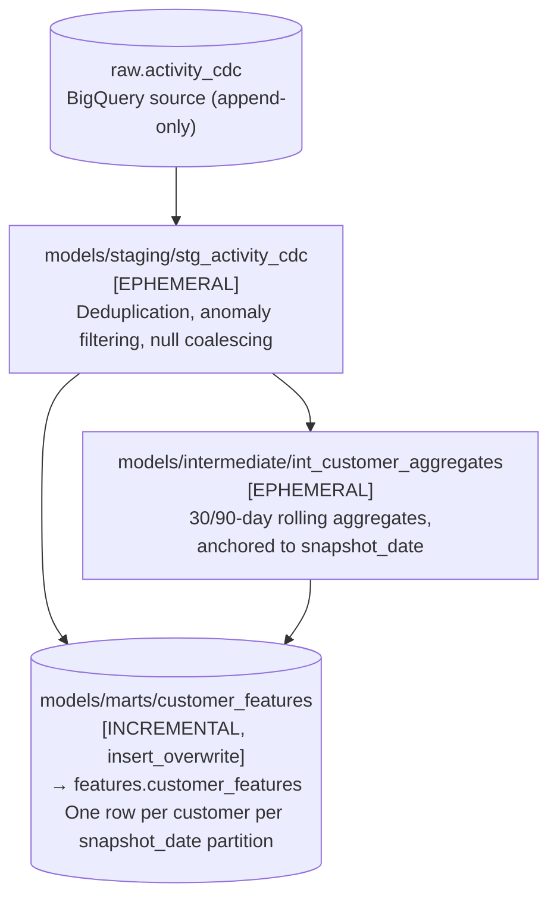
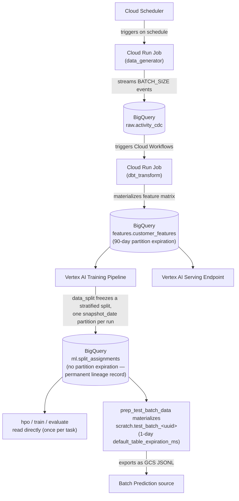

# Data Lifecycle & ELT Engine

The data engine operates on an automated, event-driven ELT (Extract, Load, Transform) pattern designed to simulate real-world transactional applications.

---

## Synthetic Data Generation (CDC Simulation)

To accurately model an enterprise data stream, a data generator application executes as an ephemeral task on a scheduled frequency. Crucially, **this job simulates a Change Data Capture (CDC) feed from an upstream transactional database** (like PostgreSQL).

Instead of overwriting a static state table, it generates an append-only log of synthetic user activity, billing cycles, profile adjustments, and service interaction events. Appending these raw, immutable telemetry records directly to ingestion tables in BigQuery guarantees point-in-time correctness, prevents historical data leakage, and forces the downstream ELT layer to correctly reconstruct user features. To test system resilience, the generator also exposes configuration variables capable of manually injecting structural feature anomalies or sudden behavioral shifts.

### Configuration Variables

The generator is fully controlled by environment variables injected at Cloud Run Job runtime:

| Variable | Required | Default | Description |
|---|---|---|---|
| `BQ_PROJECT_ID` | Yes | — | GCP project hosting the target BigQuery dataset |
| `BQ_DATASET_ID` | Yes | — | Target dataset (e.g. `raw`) |
| `BQ_TABLE_ID` | Yes | — | Target table (e.g. `activity_cdc`) |
| `BATCH_SIZE` | No | `2000` | Number of events to generate and stream-insert per invocation |
| `ANOMALY_RATE` | No | `0.0` | Fraction of events that carry injected out-of-range feature values (0.0–1.0) |
| `USER_POOL_SIZE` | No | `10000` | Founding customer base, acquired on the pool epoch |
| `DAILY_ACQUISITIONS` | No | `25` | New customers acquired per elapsed day since the pool epoch |

### Customer Pool

Customer identities are **stable across runs**. Every profile is derived deterministically from its index — `uuid5` for the id, an RNG seeded with the index for its traits — so customer *n* is the same customer on every invocation and their events accumulate into a single history. Nothing is persisted between runs to achieve this; the pool is reconstructed identically each time.

This is load-bearing rather than cosmetic. Every column in `customer_features` is a window aggregate over one customer's own history — `avg_transaction_30d`, `events_last_90d`, `payment_failure_rate_30d`, `days_since_last_successful_payment`, `renewal_count`. An earlier version minted a fresh `uuid4()` pool on every run, so no customer ever received a second event. Measured in production, that produced **32,609 customers over 14 days at 1.1 events each, with zero spanning more than one day**: every window aggregate collapsed to a constant or a two-to-three-value discrete, and the `churned` label — read from the customer's most recent event — was a single coin flip uncorrelated with any accumulated behaviour. The model was being fit to noise, and the drift monitor was watching features that could not move.

| Trait | Description | Missing value effect |
|---|---|---|
| `preferred_channel` | The customer's primary interaction channel | Drives the `channel` field on every event |
| `is_offline_only` | `True` when channel is `direct_mail` or `phone` (~33% of customers) | `engagement_score = NULL` on every event — **MAR**: missingness is fully explained by `channel` |
| `always_fails_payments` | `True` for ~8% of customers | `payment_status` is always `failed` or `pending`, never `success` — produces `days_since_last_successful_payment = NULL` in the feature matrix — **MNAR**: missingness correlates with elevated churn |
| `tenure_days_at_join` | Tenure on joining; `None` for ~3% of customers | `member_since_days = NULL` in the feature matrix — **MCAR**: missing at random, no correlation with outcome |
| `membership_tier`, `region` | Fixed per customer | Previously drawn per event, which made a customer appear in a different tier and region on every event — with `customer_features` reading whichever the latest event carried, both columns were noise |

`member_since_days` is `tenure_days_at_join` plus the days since that customer joined, so tenure advances with time instead of being a fixed random draw. Daily acquisition is what keeps the resulting distribution at a steady state: in a closed base, tenure would climb for everyone at once and become a permanent source of drift.

This design ensures that missing values in the feature matrix arise from structurally consistent customer behaviour rather than random per-event noise, making them suitable for imputation strategy selection during model training.

### Churn Is Absorbing

A customer who churns emits a final `membership_cancelled` event and is never selected again. The generator reads back the set of already-churned customers from `raw.activity_cdc` at the start of each run and excludes them, and within a run a customer is removed from the selectable set the moment their event comes back flagged.

Both halves matter, because `customer_features` derives the label from the customer's *most recent* event. Without them, a customer would flicker between churned and not-churned as later events overwrote earlier ones, and the target would describe a moment rather than the customer. `membership_cancelled` is correspondingly reserved for a real churn rather than being one of the event types an active customer emits at random.

A read failure degrades to treating the whole base as active. That keeps generating events for customers who have left — a visible data problem rather than a silent one — which is preferable to failing the run and producing nothing.

### Event Schema

Every row written to BigQuery contains the following fields:

| Field | Type | Description |
|---|---|---|
| `event_id` | STRING | Unique UUID for this event |
| `event_timestamp` | TIMESTAMP | UTC time of generation (ISO 8601) |
| `customer_id` | STRING | UUID identifying the synthetic customer |
| `event_type` | STRING | One of: `transaction`, `membership_renewal`, `campaign_action`, `email_engagement`, `event_attended`, `contact_request`, `membership_cancelled` |
| `region` | STRING | One of: `us-east`, `us-west`, `eu-west`, `eu-central`, `apac`, `latam` |
| `membership_tier` | STRING | One of: `supporter`, `friend`, `champion`, `guardian` |
| `monthly_transaction` | FLOAT64 | Sampled from a Normal distribution anchored to the tier's base amount; clipped to ≥ 0 |
| `payment_status` | STRING | One of: `success`, `failed`, `pending` |
| `payment_attempts_last_30d` | INT64 | Sampled from a Poisson(λ=1.5) distribution |
| `engagement_score` | FLOAT64 \| NULL | Sampled from a Beta(α=2, β=5) distribution; range [0, 1]. **NULL** for offline-channel customers (`direct_mail`, `phone`) — MAR |
| `member_since_days` | INT64 \| NULL | Uniform random integer in [1, 3650]. **NULL** for ~3% of customers with no recorded start date — MCAR |
| `contact_requests_last_30d` | INT64 | Sampled from a Poisson(λ=0.3) distribution |
| `churned` | BOOL | Derived probabilistically (see churn logic below) |
| `channel` | STRING | One of: `email`, `web`, `mobile`, `direct_mail`, `in_person`, `phone` |
| `raw_payload` | STRING | JSON-serialised snapshot of all core fields (excludes itself and `anomaly_injected`) |
| `anomaly_injected` | BOOL | `TRUE` when the event carries deliberately out-of-range values |

### Churn Signal Logic

Churn probability is not uniform — it is elevated for customers exhibiting distress signals:

| Condition | Per-event churn hazard |
|---|---|
| `engagement_score IS NULL` **or** `engagement_score < 0.15` **or** `payment_attempts_last_30d > 5` **or** `always_fails_payments = True` | **2%** |
| Otherwise | **0.2%** |

This asymmetry creates a learnable signal for the downstream ML model without making churn trivially predictable.

These are per-event *hazards* on an absorbing state, not the per-event coin flip they replace. A customer now sees many events over their lifetime and each one is a fresh opportunity to churn, so the rates are an order of magnitude lower than the previous 25%/4% — at the old values the entire base would cancel within days.

### Anomaly Injection

When `ANOMALY_RATE > 0`, a fraction of events replace their numerical fields with deliberately out-of-range values. This simulates upstream data quality failures and exercises the drift detection layer:

| Field | Normal range | Injected anomaly values |
|---|---|---|
| `monthly_transaction` | ≥ 0 | `-999.0`, `0.0`, `9999.99` |
| `engagement_score` | [0, 1] | `-1.0`, `5.0`, `99.9` |
| `payment_attempts_last_30d` | ≥ 0 | 50–200 |

Anomalous events are flagged with `anomaly_injected = TRUE`, allowing downstream queries to isolate or filter injected rows independently of the drift detection system.

---

## Feature Engineering Layer

Transformations, aggregations, and windowing functions are completely decoupled from Python code and handled within the data warehouse layer using a containerized instance of `dbt Core`. The dbt project lives at `projects/dbt_transform/` and runs as a Cloud Run Job (`dbt-job`). On each invocation it executes `dbt run --profiles-dir .`, which writes a complete feature snapshot for every customer into a new daily partition of `features.customer_features`.

### Configuration Variables

The dbt job is controlled by environment variables injected at Cloud Run Job runtime:

| Variable | Required | Default | Description |
|---|---|---|---|
| `BQ_PROJECT_ID` | Yes | *(injected by Terraform)* | GCP project hosting BigQuery |
| `BQ_LOCATION` | No | `EU` | BigQuery dataset location for job routing |

### Model Graph & Materialization Strategy

The dbt project executes a three-model graph. Staging and intermediate models use **ephemeral** materialization — they compile into CTEs inlined directly into the final query and create no BigQuery objects. The marts model uses **incremental** materialization with `insert_overwrite`: on each run dbt computes a full feature snapshot for all customers and writes it into the partition matching `CURRENT_DATE()`, overwriting that day's partition if it already exists and leaving all previous partitions untouched. This gives a complete, queryable history of feature states keyed by `snapshot_date`.

A **mart** (short for data mart) is the final, consumer-ready layer in a dbt project. Where staging and intermediate models clean and reshape raw data, a mart assembles everything into a purpose-built table that downstream systems — in this case Vertex AI training and the serving endpoint — can query directly without any further transformation.

### Layer 1 — Staging: `stg_activity_cdc`

**Source:** `raw.activity_cdc`  
**File:** `models/staging/stg_activity_cdc.sql`  
**Materialization:** ephemeral

Cleans the raw CDC log before any aggregation:

- **Anomaly filtering** — rows where `anomaly_injected = TRUE` are excluded so that injected out-of-range values never contaminate the feature matrix.
- **Deduplication** — BigQuery streaming inserts can produce short-window duplicates. A `ROW_NUMBER()` window partitioned on `event_id` keeps the latest version of each event.
- **Selective null coalescing** — count fields where `0` is the correct missing-value substitute (`monthly_transaction`, `payment_attempts_last_30d`, `contact_requests_last_30d`) are coalesced to `0`; `churned` to `FALSE`. `engagement_score` and `member_since_days` are intentionally left as `NULL` so their missingness propagates to the feature matrix for ML imputation.
- `raw_payload` and `anomaly_injected` are dropped — they are not needed downstream.

### Layer 2 — Intermediate: `int_customer_aggregates`

**Source:** `stg_activity_cdc`  
**File:** `models/intermediate/int_customer_aggregates.sql`  
**Materialization:** ephemeral

Computes per-customer behavioral aggregates. All rolling windows are **relative to the snapshot date** — `DATE_DIFF(CURRENT_DATE(), DATE(event_timestamp), DAY)` as `days_since_event` — matching the `snapshot_date` that `customer_features` stamps in the same run, so a feature row and its partition key always describe the same day.

They were previously anchored to each customer's own `MAX(event_timestamp)`, which is the difference between a feature that measures recency and one that cannot. Under per-customer anchoring, `events_last_30d` meant "events in the 30 days before this customer last did anything": a customer dormant for six weeks and one active this morning described entirely different calendar periods in the same column and were indistinguishable to the model. Every window also necessarily contained the anchor event itself, so `events_last_30d` could never be 0 and dormancy — the strongest churn signal there is — was unrepresentable.

`days_since_last_successful_payment` showed the cost most plainly. Measured from the customer's own last event it was **0 for all 11,193 customers that had a value at all**, while true calendar staleness spanned 16 days; the column whose entire purpose is recency was a constant, which is also why the drift monitor reported it as carrying no usable signal. Anchored to the snapshot date it takes 14 distinct values across 0–16 days.

A consequence worth expecting: windows can now legitimately be empty. `events_last_30d = 0` and a `NULL` `avg_transaction_30d` mean "this customer did nothing in that window", which is information, not a defect. (It reads as 0 dormant customers today only because `raw.activity_cdc` holds ~16 days of events so far — nobody *can* be 30-day dormant until the history is older than the window.)

| Feature group | Columns produced |
|---|---|
| **Transaction rolling averages** | `avg_transaction_30d`, `avg_transaction_90d` |
| **Payment health** | `payment_failure_rate_30d`, `payment_failure_rate_90d` (failed / total events in window), `total_payment_attempts` |
| **Payment recency** | `days_since_last_successful_payment` — days since last `payment_status = 'success'`; **NULL** when no successful payment exists (MNAR — see Customer Pool section) |
| **Engagement rolling averages** | `avg_engagement_30d`, `avg_engagement_90d` |
| **Engagement behaviour** | `campaign_participation_rate` (fraction of events that are `campaign_action`), `preferred_channel` (mode via `APPROX_TOP_COUNT`) |
| **Activity counts** | `total_events`, `events_last_30d`, `events_last_90d`, `renewal_count` |

### Layer 3 — Mart: `customer_features`

**Sources:** `stg_activity_cdc`, `int_customer_aggregates`  
**File:** `models/marts/customer_features.sql`  
**Materialization:** incremental (`insert_overwrite`, partitioned by `snapshot_date`) → `features.customer_features`

Produces one row per customer by joining the rolling aggregates with the customer's latest state. The latest state is extracted with `QUALIFY ROW_NUMBER() OVER (PARTITION BY customer_id ORDER BY event_timestamp DESC) = 1`.

`snapshot_date` partitions expire after 90 days (see [iac.md](iac.md#bigquery-tables-bq_table-module)) so the table doesn't grow unbounded from one full customer snapshot being appended every dbt run. This is safe because nothing reads an old partition: `data_split` freezes the exact rows each training run used into `ml.split_assignments`, which never expires (see [ml-infrastructure.md](ml-infrastructure.md)).

#### Full schema

| Column | Type | Description |
|---|---|---|
| `customer_id` | STRING | Customer UUID — primary key |
| `membership_tier` | STRING | Tier at most recent event (`supporter` / `friend` / `champion` / `guardian`) |
| `region` | STRING | Region at most recent event |
| `member_since_days` | INT64 \| NULL | Tenure in days at most recent event; NULL for ~3% of customers (MCAR) |
| `contact_requests_last_30d` | INT64 | Contact requests at most recent event |
| `avg_transaction_30d` | FLOAT64 | Average monthly transaction over last 30 days |
| `avg_transaction_90d` | FLOAT64 | Average monthly transaction over last 90 days |
| `payment_failure_rate_30d` | FLOAT64 | Fraction of payments that failed in last 30 days |
| `payment_failure_rate_90d` | FLOAT64 | Fraction of payments that failed in last 90 days |
| `total_payment_attempts` | INT64 | Cumulative sum of `payment_attempts_last_30d` across all events |
| `days_since_last_successful_payment` | INT64 \| NULL | Days since last success; NULL = no successful payment on record (MNAR) |
| `avg_engagement_30d` | FLOAT64 \| NULL | Average engagement score over last 30 days; NULL for offline-channel customers (MAR) |
| `avg_engagement_90d` | FLOAT64 \| NULL | Average engagement score over last 90 days; NULL for offline-channel customers (MAR) |
| `campaign_participation_rate` | FLOAT64 | Fraction of all events that are `campaign_action` |
| `preferred_channel` | STRING | Most frequent interaction channel |
| `total_events` | INT64 | Total event count across full history |
| `events_last_30d` | INT64 | Event count in last 30 days |
| `events_last_90d` | INT64 | Event count in last 90 days |
| `renewal_count` | INT64 | Total `membership_renewal` events |
| `latest_event_ts` | TIMESTAMP | Timestamp of the customer's most recent event |
| `feature_computed_at` | TIMESTAMP | UTC time when this row was materialized |
| **`churned`** | **BOOL** | **Target label** — TRUE if most recent event signals churn |
| `snapshot_date` | DATE | Partition key — the calendar date on which dbt ran and produced this snapshot |

This table is the direct input to the Vertex AI training pipeline and the serving endpoint for real-time inference.

### `customer_features_current`

A second marts model holding only the newest partition of `customer_features`, with the label and build-metadata timestamps removed. It exists because Vertex AI's `bigquerySource` takes a table reference with no row filter, so scoping the daily scoring run to one snapshot has to happen in the transformation layer. Built by the same `dbt build` invocation as the mart, so it can never drift out of step with it. See [ml-infrastructure.md](ml-infrastructure.md) for why the daily job must not score the full mart.

### Contract enforcement

The dbt container's entrypoint is `dbt build`, not `dbt run`. `build` interleaves each model with its declared `schema.yml` tests in DAG order, so a model whose contract is violated fails rather than silently feeding everything downstream. Under `dbt run` those tests were declared but never executed — `customer_features`' grain, `event_id` uniqueness and the `membership_tier` domain were documented guarantees that nothing checked. A failure here halts the orchestrator *before* batch prediction, which is earlier than the drift monitor's data-quality gate can catch the same class of problem (see [observability.md](observability.md)).

`customer_features`' uniqueness test is on `(customer_id, snapshot_date)`, not `customer_id` alone. The single-column test used to pass only because the generator minted a fresh customer pool every run, so no customer ever appeared on two days; with stable identities the same customer legitimately recurs across partitions.

> **Data mart vs. feature store:** `customer_features` is a **data mart** — a denormalized, consumer-ready table scoped to a specific use case (churn prediction). The term describes *how data is shaped and where it lives*, nothing more. A **feature store** is a higher-level MLOps infrastructure component built on top of that kind of storage. It adds: (1) **point-in-time correctness** — serving only features that existed before each label's timestamp to prevent training/serving skew; (2) **online + offline serving** — a low-latency store (e.g. Bigtable or Redis) alongside the offline warehouse table; and (3) **feature versioning and reuse** — a central registry that multiple models and teams share. In a real enterprise scenario the correct solution here is **Vertex AI Feature Store**, which provides all three. The partitioned BigQuery table used here is a pragmatic approximation: it achieves reproducibility by pinning a training job to a specific `snapshot_date` partition, but it requires the caller to enforce point-in-time correctness manually and has no online-serving layer. Feature Store was omitted to keep the infrastructure footprint simple and self-contained.

---

## Data Flow Summary

See [ml-infrastructure.md](ml-infrastructure.md#why-the-split-lives-in-bigquery-not-pandasparquet) for why the split is computed and frozen in BigQuery rather than loaded into pandas.
