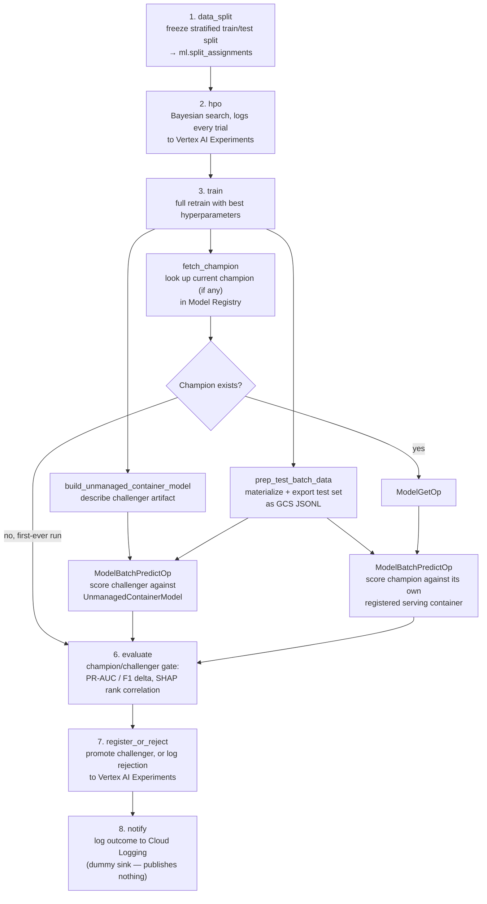
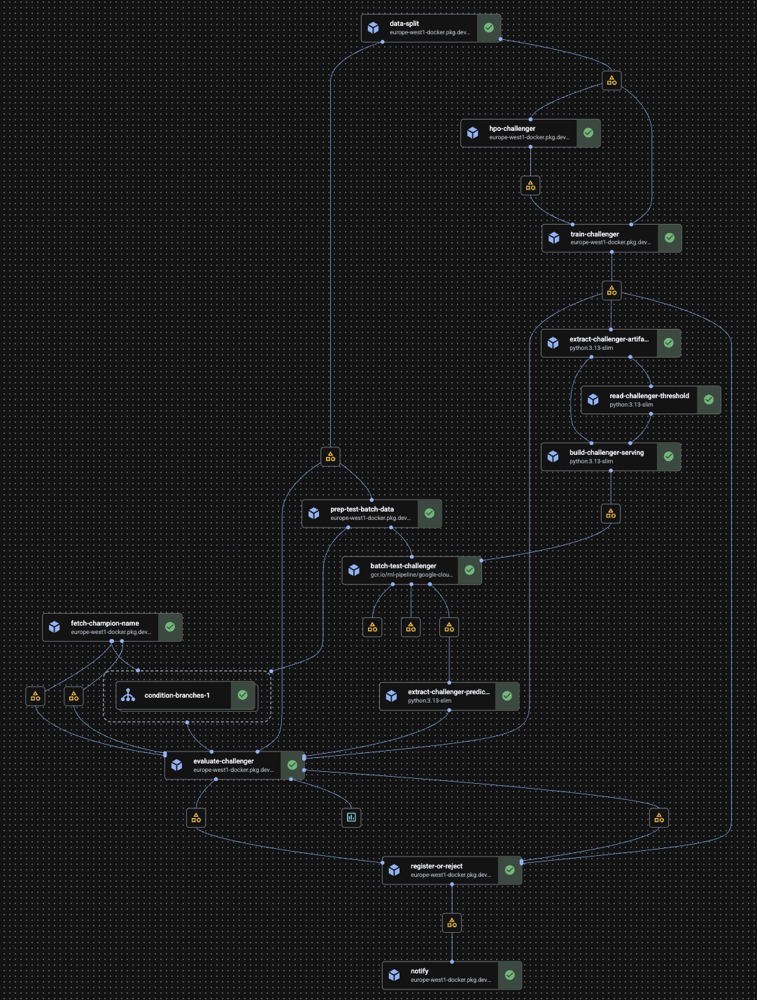

# ML Infrastructure

This document covers the platform and MLE concerns: how the training pipeline runs on GCP, how experiments are tracked, how model artifacts are stored and validated, and how the containers are built. For model design decisions, HPO strategy, and evaluation criteria, see [model-development.md](model-development.md).

---

## Experiment Tracking & Lineage

Experiment tracking uses the **Vertex AI Experiments native SDK** directly. Each pipeline stage calls `aiplatform.init()` with the target experiment, then logs parameters and metrics via `aiplatform.log_params()` and `aiplatform.log_metrics()`. No third-party tracking library is required.

```python
import google.cloud.aiplatform as aiplatform

aiplatform.init(project=PROJECT_ID, location=REGION, experiment=EXPERIMENT_NAME)
aiplatform.start_run(run_name)
aiplatform.log_params({"max_depth": 5, "learning_rate": 0.05})
aiplatform.log_metrics({"cv_pr_auc_mean": 0.83})
aiplatform.end_run()
```

Each HPO trial logs the following to Vertex AI Experiments:

- Hyperparameter values for that trial
- Mean and standard deviation of PR-AUC across CV folds (`cv_pr_auc_mean`, `cv_pr_auc_std`)

The full training run (after HPO) additionally logs:

- Best hyperparameter values
- Per-feature mean |SHAP| values
- Output artifact URI in GCS

Runs are visible in the Vertex AI Experiments console and queryable via the MLflow client, providing a complete, auditable lineage trace: feature snapshot → runtime image → hyperparameters → evaluation metrics → artifact URI.

---

## SHAP Feature Importance Logging

Every training run computes global mean |SHAP| values for all input features and logs them to Vertex AI Experiments alongside the standard evaluation metrics. They're also written to `metadata.json` in the run's GCS artifact directory (alongside `model.ubj`, see [Experiment Tracking](#experiment-tracking)). When a challenger is promoted to champion, that same `metadata.json` — read via the registered `Model`'s `uri` — becomes the **baseline** the next cycle's `fetch_champion` stage reads back (the Vertex AI Model resource has no writable custom-metadata field for custom-trained models, so the GCS artifact directory is the source of truth rather than the registry entry itself).

These per-run importance scores serve two purposes:

- **Interpretability** — every run in Vertex AI Experiments carries a complete record of which features drove the model at that point in time, making it possible to audit decisions after the fact.
- **Feature review trigger** — the `evaluate` stage computes the Spearman rank correlation between the challenger's SHAP importance ranking and the champion's stored baseline. The result is included in the `metrics` artifact passed downstream. If the correlation drops below **0.75**, the feature set has drifted in relevance and the outbound notification includes a feature review warning. See [feature-exploration.md](feature-exploration.md) for the full trigger mechanism.

---

## Champion vs. Challenger Gate

Model deployment is governed by a programmatic gatekeeper step inside the training pipeline. The challenger and the champion are both scored externally, through their own serving container via **Vertex AI Batch Prediction**, rather than in-process by the `evaluate` step:

- **Challenger** — scored via a `ModelBatchPredictOp` job against an `UnmanagedContainerModel` (built by `build_unmanaged_container_model`, a lightweight pipeline step) pointing at the freshly-trained artifact and the `serving` image itself. The challenger isn't registered in Model Registry yet — it may still be rejected — so there's no Model resource to batch-predict against; `UnmanagedContainerModel` carries the same artifact-URI + serving-container-spec information without requiring registration.
- **Champion** — scored via the same `ModelBatchPredictOp` mechanism, but against the champion's own registered serving container (`ModelGetOp` + `ModelBatchPredictOp`). This avoids a real dependency-skew risk: `register_or_reject` permanently freezes the `serving_container_image_uri` on each registered model at the time it's registered, so a champion promoted months ago may have been built against different library versions than today's pipeline images. `fetch_champion` hands `ModelGetOp` the champion's **bare model ID**, not its full resource name: `ModelGetOp` interpolates whatever it gets into `projects/{project}/locations/{location}/models/{model_name}` itself, so a full resource name produces a doubly-prefixed name and a `400 INVALID_ARGUMENT` from `GetModel`.

Neither model is ever loaded in-process by `evaluate`/`post-training` — `evaluate` only consumes the two customer_id-keyed prediction sets and runs the gate math (PR-AUC/F1 delta, SHAP rank correlation) over them. This means the metrics that decide promotion and the predictions production will actually serve are, by construction, the same number — there is no separate scoring pass that could silently drift from what gets promoted. See [Serving Compatibility Validation](#serving-compatibility-validation) for why both models are scored this way instead of in-process.

The conditional `fetch_champion` → `prep_test_batch_data` → (`ModelGetOp` → `ModelBatchPredictOp`, skipped if no champion exists yet) → `evaluate` flow, together with the challenger's `build_unmanaged_container_model` → `ModelBatchPredictOp` branch (which runs in parallel, depending only on `train` and `prep_test_batch_data`), produces two artifacts: `metrics` (challenger/champion metrics, threshold, SHAP rank correlation — the scored facts, no verdict) and `decision` (just `promote: bool` and the deltas that drove it). Splitting them keeps the scored facts inspectable in the Vertex AI Pipelines UI independent of the verdict, and keeps `evaluate` the only place that knows the promotion thresholds. The `register_or_reject` stage acts mechanically on `decision` (and reads `threshold` off `metrics` to bake into the registered model's serving container): only a promoted challenger is registered in Vertex AI Model Registry, with `role=champion`. There's no shadow testing or compliance requirement that needs rejected candidates sitting in the registry, so a rejected challenger is never registered — it's logged to Vertex AI Experiments instead (see [Consecutive rejection counter](#consecutive-rejection-counter)), keeping the registry limited to versions that were or are actually serving traffic.

For the promotion criteria the data scientist controls (PR-AUC delta, F1 delta, recall target), see [model-development.md](model-development.md).

### Re-joining predictions by customer_id

Vertex AI Batch Prediction shards and parallelizes its output, so neither model's result files are **guaranteed to preserve the input instances' row order**. Both `ModelBatchPredictOp` calls are configured with `key_field="customer_id"`, so `customer_id` is excluded from what's actually sent to the serving container as a prediction instance and instead comes back on each output record under its original field name, `customer_id` (not literally `key`, despite what the `key_field` docs say — confirmed against actual `BatchPredictionJob` output). The `evaluate` step's `read_batch_predictions` re-joins each prediction back onto the test set by that `customer_id` rather than assuming positional alignment — used identically for both the challenger's and the champion's Batch Prediction output. It goes through the shared `_proba_in_customer_id_order` helper, which raises if any `customer_id` is missing a prediction (e.g. from a partially failed batch job) instead of silently propagating `NaN` into the PR-AUC/F1 gate.

### Consecutive rejection counter

Since rejected challengers are never registered, the rejection count can't live on a Model Registry version — it's persisted as a small JSON state file in GCS instead (`gs://<project>-pipeline-metadata/post-training-state/<experiment_name>/<consecutive_rejection_key>.json`), read and written directly by `_get_rejection_count`/`register_or_reject`. On each rejection the file is rewritten with the incremented count; on a successful promotion, it's reset to zero. When the count reaches 3, the `notify` stage escalates to a feature review alert.

This counter used to be derived from Vertex AI Experiments run history (`ExperimentRun.list()` + sorting timestamp-prefixed `register-*` runs), but that approach resolves *every* run in the experiment, including the ~100 HPO trial runs (`hpo-trial-*`) the trainer logs per retraining cycle — and each resolution triggers its own Tensorboard time-series lookup. That fan-out grows every retraining cycle and eventually exceeds the `aiplatform.googleapis.com` regional CRUD-request quota (`429 TooManyRequests`), so it was replaced with the O(1) GCS read/write above. `register_or_reject` still logs a timestamp-prefixed `register-<unix-ts>-<suffix>` run to Vertex AI Experiments on every execution (outcome, model version, counter value), but purely for lineage/audit — it's no longer read back. See [feature-exploration.md](feature-exploration.md) for the DS workflow that follows.

### Post-promotion outcome report

The pipeline's terminal `notify` stage logs the run outcome — promoted/rejected, model version ID, both models' metrics, the consecutive-rejection count and the feature-review flag — to Cloud Logging. It is a deliberate dummy: nothing is published and no email is sent. See [observability.md](observability.md) for why, and for what a real consumer would attach to.

---

## Pipeline Stages

The full ML pipeline is compiled as a **Kubeflow Pipelines (KFP) graph** and submitted to Vertex AI Pipelines. The stages execute in the following order:

```
1. data_split                — Freeze a stratified train/test split of features.customer_features
                                 into ml.split_assignments
2. hpo                       — Bayesian HPO search; logs all trials to Vertex AI Experiments
3. train                     — Full retrain with best hyperparameters on complete dataset
4. fetch_champion              ─┐ run in parallel: look up the current champion (if any) in
   prep_test_batch_data      │ Model Registry, and materialize + export the test set as
                                 GCS JSONL for Batch Prediction
   build_unmanaged_container_model
   → ModelBatchPredictOp       ─┘ score the just-trained challenger via Batch Prediction against
                                  an UnmanagedContainerModel pointing at the serving image
5. [if champion exists]      — ModelGetOp + ModelBatchPredictOp (native Vertex Pipelines ops):
                                 score the champion via Batch Prediction against its own
                                 registered serving container; skipped on the first-ever run
6. evaluate                  — Run champion/challenger gate over each model's own serving-image
                                 predictions; compute metrics and SHAP rank correlation
7. register_or_reject        — Register Challenger as champion if promoted, else log the
                                 rejection to Vertex AI Experiments
8. notify                    — Log the promotion or rejection outcome to Cloud Logging
                                 (dummy sink — publishes nothing)
```



The screenshot below is the actual compiled DAG as it runs on Vertex AI Pipelines:



`data_split`/`hpo`/`train` run on the `trainer` container image; `fetch_champion`/`prep_test_batch_data`/`evaluate`/`register_or_reject`/`notify` run on the `post-training` container image — see [Container Images](#container-images) below for why these are two separate images. Both the challenger's and the champion's Batch Prediction branches run prebuilt `google-cloud-pipeline-components` ops (`ModelGetOp`/`ModelBatchPredictOp`), not a custom container — this is the first use of prebuilt ops and of conditional branching (`dsl.If`/`dsl.Else`/`dsl.OneOf`) in this pipeline, deliberately chosen over a hand-rolled `BatchPredictionJob.create` call so the batch job gets proper Vertex ML Metadata lineage and pipeline caching for free. The challenger's branch additionally runs a small lightweight Python step, `build_unmanaged_container_model`, to describe the not-yet-registered artifact as an `UnmanagedContainerModel` — see [Serving Compatibility Validation](#serving-compatibility-validation) below. Pinned dependency versions ensure reproducibility across pipeline executions.

`data_split` and `fetch_champion_name` explicitly disable KFP caching (`.set_caching_options(False)`); every other stage leaves it on. Both read live external state — the current contents of `features.customer_features`, and whichever model currently holds `role=champion` — that a KFP cache key can't see change: the key is derived from resolved parameter strings (table name, `model_display_name`), not from the data or registry state behind them. A cache hit on either would re-run this drift-triggered retrain against stale data or gate the challenger against a stale champion. Downstream stages don't need the same treatment: once these two run fresh, their output artifact URIs change, which busts the cache for every task consuming them anyway.

### Why the split lives in BigQuery, not pandas/Parquet

`data_split` used to pull the entire `features.customer_features` snapshot into a pandas DataFrame via `bigquery.Client().query(...).to_dataframe()`, split it in memory with sklearn's `train_test_split`, and re-upload two Parquet files to GCS. That doesn't scale past a single machine's RAM, and the resulting Parquet copy expired after the `training-data` bucket's 30-day lifecycle — so no model's exact training data survived past that window.

The split is now computed entirely in BigQuery and frozen as a permanent partition of **`ml.split_assignments`** — one row per customer per `snapshot_date`, containing the full feature row plus which split (`train`/`test`) it fell into:

```sql
-- destination: ml.split_assignments$YYYYMMDD, write_disposition: WRITE_TRUNCATE
SELECT f.* EXCEPT (feature_computed_at, latest_event_ts),
  IF(PERCENT_RANK() OVER (PARTITION BY churned ORDER BY FARM_FINGERPRINT(CAST(customer_id AS STRING)))
     < @train_fraction, 'train', 'test') AS split,
  CURRENT_TIMESTAMP() AS assigned_at
FROM `{project}.features.customer_features` f
WHERE snapshot_date = @snapshot_date;
```

`PARTITION BY churned` gives an exact stratified split — the same class-balance guarantee as sklearn's `stratify=` — computed once per `snapshot_date` rather than once per downstream reader. `hpo`/`train`/`evaluate` then read straight from `ml.split_assignments` via `bigquery.Client().query(...).to_dataframe(create_bqstorage_client=True)`, once per task — there's no pandas load anywhere in `data_split` itself, and no redundant GCS copy of the frozen split.

The write targets the **partition decorator** (`ml.split_assignments$YYYYMMDD`) with `WRITE_TRUNCATE`, rather than a `DELETE` followed by an `INSERT`. Both give the same replace-this-partition semantics on a re-run, but the decorator form is a single atomic job. Two retraining pipelines can overlap — drift can trigger one while an earlier one is still running, since the orchestrator submits training fire-and-forget — and with two statements one run's `DELETE` can land inside the other's `INSERT`, leaving the partition half-written. A lineage record is only worth keeping if it can never be observed partially replaced. (The orchestrator's `last_retrain_status` guard makes that overlap rare; this makes it harmless. See [observability.md](observability.md).)

A few things drove this design, beyond just removing the in-memory load:

- **Reproducibility, not just consistency** — dbt's `insert_overwrite` materialization means a `features.customer_features` partition is *not* immutable; a same-day rerun can overwrite it (see [data-lifecycle.md](data-lifecycle.md)). A live BigQuery view over the feature table wouldn't be enough on its own — `ml.split_assignments` is a physical snapshot taken at `data_split` time, insulated from any later mutation of that partition.
- **Lineage that outlives the Parquet bucket's 30-day lifecycle** — `ml.split_assignments` has **no partition expiration**, deliberately kept longer than any GCS bucket's lifecycle rule. It's the permanent, SQL-queryable answer to "exactly which customers, and which feature values, trained/evaluated model X" — cheap to keep indefinitely since it's the same row count as the feature table, not a second copy of everything.
- **No unbounded resource growth** — this is one table with a `for_each`-managed Terraform lifecycle, partitioned by `snapshot_date`, not one table per pipeline run.

### Why Batch Prediction reads from GCS JSONL exported out of a scratch BigQuery table

Vertex AI's `BatchPredictionJob` requires `instances_format`/`predictions_format` to either both be `"bigquery"` or both be non-`"bigquery"` — pairing `bigquery_source_input_uri` with `gcs_destination_output_uri_prefix` (or vice versa) is rejected outright (`400 Bigquery format must be used as input and output simultaneously`). Since the output side must stay on GCS (see below), the source must be GCS JSONL too, so both `ModelBatchPredictOp` calls use `instances_format="jsonl"` / `gcs_source_uris` instead of `bigquery_source_input_uri`.

`prep_test_batch_data` still materializes the test split into a short-lived table (`scratch.test_batch_<uuid>`) first — BigQuery can only extract to GCS from a physical table, not an arbitrary filtered query — then runs a BigQuery extract job to write it out as sharded JSONL (`test-*.jsonl`) under `batch_test_gcs_prefix`, and that GCS URI is what's fed to both batch-predict jobs. The `scratch` dataset has a `default_table_expiration_ms` (1 day) so the intermediate table self-cleans, the same role the GCS bucket lifecycle rules play elsewhere in this repo, without accumulating tables across runs.

Batch Prediction's **output** deliberately stays on GCS (`gcs_destination_output_uri_prefix`, unchanged), not BigQuery. `bigquery_destination_output_uri` creates a brand-new, unmanaged, auto-named dataset (`prediction_<model>_<job-create-time>`) on every single batch-predict job with no built-in expiration — using it here would reintroduce unbounded resource growth on the output side, just as datasets rather than rows in one partitioned table. GCS already has a clean, Terraform-managed, self-expiring bucket lifecycle for this, so there was no reason to move it.

### Compute sizing for `hpo`/`train`: native task limits, not `CustomTrainingJobOp`

`hpo` and `train` run as plain KFP `container_component` pipeline steps with `.set_cpu_limit("2").set_memory_limit("8G")` applied at the call site in `pipeline.py`, rather than being wrapped in `google_cloud_pipeline_components`'s `CustomTrainingJobOp` (via `create_custom_training_job_from_component`).

`CustomTrainingJobOp` launches a separate Vertex AI Training Job resource (its own console entry, IAM/service-account surface, and job-creation/polling round trip) on top of the pipeline step, and its main extra capability — distributed training across multiple worker pools (chief/worker/parameter-server/evaluator) — only matters for training that's actually distributed. It isn't here:

- `run_hpo_stage` (`modeling/hpo.py`) calls `optuna.create_study(...).optimize(objective, n_trials=n_trials)` with the default `n_jobs=1` — all trials run sequentially in one process.
- Each trial's `objective()` loops over `StratifiedKFold` folds sequentially — one `XGBClassifier` fit per fold, no joblib/multiprocessing.
- Vertex AI Experiments is used only for per-trial logging, not for distributing compute.

So `hpo`/`train` are single-machine XGBoost workloads end to end. Native KFP resource limits (`.set_cpu_limit`/`.set_memory_limit`/`.set_accelerator_type`) already let Vertex AI Pipelines provision a dedicated machine per task with the requested shape — the same lever `CustomTrainingJobOp` would give, without the extra job resource, IAM surface, or latency. `CustomTrainingJobOp` would be worth the overhead if `hpo` ever became a genuinely distributed search (e.g. parallel Optuna trials fanned out across multiple worker replicas) or `train` moved to a model family needing multi-replica/distributed training — neither applies to tabular XGBoost on this dataset size.

**Named machine types and Spot pricing were considered and rejected too, for the same reason.** `CustomTrainingJobOp`'s `machine_type` parameter lets you pick an exact named machine family (e.g. `e2-standard-2` over `n1-standard-2`, ~25-30% cheaper for equivalent specs) and, more significantly, its `worker_pool_specs` support `scheduling.strategy: SPOT` — Compute Engine Spot pricing, typically 60-91% off on-demand. Both `hpo` (re-running the whole Optuna search is harmless) and `train` (a one-shot full retrain with no incremental state) are safely retriable on preemption, so they're technically Spot-eligible. The reason this still isn't used: `churn-training-pipeline` is **drift-triggered, not scheduled** — `orchestrator-workflow` only submits it when the daily PSI drift check exceeds threshold (see [orchestration.md](orchestration.md)), which in practice fires at most a few times a month. At that run frequency, the absolute dollar savings from Spot pricing on a 2 vCPU/8GB job that runs for minutes rounds to fractions of a cent per month — not worth the added job-creation latency, the second IAM/service-account surface, and the operational cost of a second resource type to monitor. The right time to revisit this is if the retraining cadence becomes materially more frequent (e.g. a fixed daily/hourly schedule) or HPO/train runtime grows enough that Spot's discount becomes a real line item.

#### What distributing `hpo` across multiple replicas would actually require

Optuna's TPE sampler doesn't block distribution the way it might seem to: a trial is just one sampled hyperparameter set evaluated via the full `n_folds` CV loop, and TPE only needs to condition on *completed* trials, not the single immediately-preceding one. Multiple workers can each pull a suggestion concurrently — they just won't see each other's in-flight (not-yet-completed) trials, a normal tradeoff shared by every distributed Bayesian-optimization system (Optuna's own distributed mode, Vizier, Ray Tune).

If `hpo` were distributed via `CustomTrainingJobOp`, the design would be:

- **Shared storage, not in-memory.** `modeling/hpo.py` would need `optuna.load_study(study_name=..., storage=postgres_url)` instead of `optuna.create_study()`, so every replica's process attaches to the same study and trial state lives in Postgres, not in any one container's memory.
- **`replica_count` (parallelism) and `n_trials` (work per replica) are two independent knobs, not derived from each other.** Vertex AI launches `replica_count` containers exactly once, at the start — there is no "wave" of containers spawned per trial or per batch. Each container is a long-lived process whose own `study.optimize(objective, n_trials=n_trials)` loop runs through *multiple* trials sequentially, pulling its next trial from the shared study only after finishing its current one. The total trials actually run is `n_trials × replica_count` (e.g. `replica_count=3, n_trials=10` → 30 trials total, as 3 concurrent containers each looping through 10) — the pipeline never computes or enforces that total itself.
- **Fold-level work stays inside one container.** Distribution happens at the trial level only: one container always runs *all* `n_folds` for whichever trial it's currently working on. Splitting folds themselves across machines would be a separate, hand-rolled fan-out/fan-in design that Optuna's shared-storage model doesn't give for free.
- **Job completion is decided by the chief replica's exit, not by trial count.** Vertex AI Custom Training Jobs treat replica 0 of the first worker pool as authoritative for job completion — once it exits, Vertex terminates the remaining replicas, even if they haven't finished their own `n_trials` loop yet. This model fits synchronous distributed training (workers converge together by design); it's a poor fit for independent, asymmetric trial loops where one replica's trials happen to fit faster than another's. Using it safely would require either keeping every replica's workload symmetric (same `n_trials`, same machine type) or adding an explicit completion barrier (e.g. each replica writes a "done" marker and blocks until it sees `replica_count` such markers before exiting).
- **New always-on cost.** The shared Postgres instance has to run continuously, even between the few-times-a-month training runs — unlike the Spot tradeoff above, this is a standing cost, not a per-run one, which makes it an even harder sell at the current trigger frequency.

None of this is implemented — it's documented here as the concrete shape the work would take if `hpo`'s search budget or run frequency ever grew enough to justify it.

---

## Container Images

| Image | Registry path | Base |
|---|---|---|
| Training + HPO | `{region}-docker.pkg.dev/{project}/containers/trainer` | Python 3.13 slim + XGBoost, Optuna, scikit-learn |
| Evaluate, register, notify | `{region}-docker.pkg.dev/{project}/containers/post-training` | Python 3.13 slim + XGBoost, scikit-learn (transitively, via `ml-common` — post-training's own code never imports either) — no Optuna/SHAP, no FastAPI |
| Score, batch prediction | `{region}-docker.pkg.dev/{project}/containers/serving` | Python 3.13 slim + XGBoost, scikit-learn, FastAPI — no Optuna/SHAP |

The trainer image is built from `projects/trainer/Dockerfile`. It installs `trainer` and its workspace dependencies `modeling`/`ml-common` in a single `uv sync` step. The post-training image is built from `projects/post_training/Dockerfile` and installs `post-training` + `ml-common` only. The serving image is built from `projects/serving/Dockerfile` and installs `serving` + `ml-common` only.

### Package responsibilities

Five packages share ML concerns but have strictly separated roles:

| Package | Owner | Contains | Containerised? |
|---|---|---|---|
| `ml-common` | Data Scientist | Feature preprocessing and the champion/challenger metrics gate — zero GCP dependencies, zero Optuna/SHAP | No — library only |
| `modeling` | Data Scientist | XGBoost training, Optuna HPO (depends on `ml-common` for preprocessing) — zero GCP dependencies | No — library only |
| `trainer` | MLE | `data_split`/`hpo`/`train` CLI stages: BQ/GCS I/O, Vertex AI Experiments logging | Yes — the trainer image |
| `post-training` | MLE | `fetch_champion`/`prep_test_batch_data`/`evaluate`/`register_or_reject`/`notify` CLI stages: champion lookup, batch-predict instance prep, the champion/challenger gate math (over predictions it's handed, never scores a model itself), Vertex AI Model Registry promotion, terminal outcome logging | Yes — the post-training image |
| `serving` | MLE | The FastAPI app implementing Vertex AI's custom-container prediction contract | Yes — the serving image |
| `training-pipeline` | MLE | KFP pipeline definition (`build_pipeline`, `compile_pipeline`, `upload_pipeline`) — `kfp`, `google-cloud-pipeline-components`, and `modeling` only | No — compile/stage steps in CI/CD |
| `drift-monitor` | MLE | PSI drift check of the latest feature snapshot against the champion's training baseline, plus a monitoring-only PSI check of the champion's live `churn_probability` output against its training-time score baseline (depends on `ml-common` for `drift.py`/`preprocess.py`) | Yes — runs as `drift-monitor-job`, a Cloud Run Job |

`evaluate`/`register_or_reject`/`notify` run on the post-training image rather than the trainer image because none of them need Optuna or SHAP — `evaluate` runs the gate math over predictions it's handed (it never loads or scores a model itself), `register_or_reject` only talks to Vertex AI Model Registry, and `notify` only logs the outcome. They run on a separate `post-training` image rather than the `serving` image because they are not serving concerns: the post-training image never handles a live prediction request — collapsing the two under one name and one image used to make it easy to mistake post-training bookkeeping for live inference. Both the challenger's and champion's predictions are instead computed by the `serving` image itself, booted by Vertex AI Batch Prediction (see [Serving Compatibility Validation](#serving-compatibility-validation)), precisely because it needs to be the live-serving code path, not a substitute for it — `evaluate`'s gate decision is computed entirely from that output, never from an in-process score. Splitting `ml-common` out of `modeling` was necessary to make any of this real: a package's full declared dependency set installs regardless of which submodule is imported, so without that split, pointing the KFP `evaluate` step at a different image would still drag in Optuna/SHAP transitively through `modeling`.

`training-pipeline` is never containerised. Cloud Build installs it with `uv sync --package training-pipeline`, compiles the pipeline YAML against the `trainer:latest`, `post-training:latest`, and `serving:latest` image tags, then pushes the compiled template to the `pipeline-templates` Artifact Registry repo (`KFP` format) via `kfp.registry.RegistryClient`. This package has its own `training-pipeline-trigger`, separate from the `trainer-trigger`/`post-training-trigger`/`serving-trigger` that build and push the runtime images — pipeline-only changes don't trigger an unnecessary container rebuild, and image-only changes don't trigger an unnecessary recompile. See [cicd.md](cicd.md) for trigger configuration.

`orchestrator-workflow` (see [orchestration.md](orchestration.md)) now submits a `PipelineJob` from the staged template automatically when the drift monitor flags drift, using the exact same `templateUri`/GCS-path conventions as the manual script below. For manual/dev runs against whatever images are currently tagged `latest`, the standalone `scripts/submit_dev_pipeline.py` (outside any workspace package — its dependencies are declared as PEP 723 inline script metadata, so `uv run scripts/submit_dev_pipeline.py` builds its own isolated env on the fly) fetches the `latest`-tagged template straight from the `pipeline-templates` Artifact Registry repo (`template_path=https://<region>-kfp.pkg.dev/<project>/pipeline-templates/churn-training-pipeline/latest`) and submits it as a `PipelineJob` under the `vertex-ai-pipeline-sa` service account — it never compiles or builds anything itself. GCS paths default to a `dev` subdirectory of the `training-data`/`pipeline-metadata` buckets so manual runs don't collide with pipeline-produced prod artifacts (the orchestrator-triggered runs use a `prod` subdirectory instead).

The serving image's entrypoint (`serving.serve`) starts a FastAPI server implementing Vertex AI's **custom-container batch prediction contract**: `GET /health` and `POST /predict`, with the model loaded once at startup from `AIP_STORAGE_URI` (the champion model's GCS artifact directory). Production batch scoring is driven by Vertex AI's own `BatchPredictionJob` API against this container, submitted daily by `orchestrator-workflow`. The serving image's registry path is baked directly into the promoted model's container spec (`serving_container_image_uri`, passed to `Model.upload` by `register_or_reject`) so Vertex AI knows which container to launch when scoring that model version — this is unrelated to, and resolved independently of, the `post-training` image used to run the registration step itself. The upload must also declare `serving_container_predict_route=/predict`, `serving_container_health_route=/health` and `serving_container_ports=[8080]`: Vertex AI classifies any image that isn't one of its own prebuilt containers as a *third-party image* and rejects every prediction job against a model registered without those routes with `400 FailedPrecondition — A model using a third-party image must specify PredictRoute and HealthRoute in ContainerSpec` (`Model.upload` supplies no defaults). This mirrors the `containerSpec` the challenger's `UnmanagedContainerModel` declares, so both sides of the champion/challenger comparison boot identically. Because Vertex AI's `UpdateModel` cannot patch `containerSpec`, a champion registered before this was fixed can only be corrected by re-uploading its artifact directory as a new version. `register_or_reject` also bakes the model's decision threshold — selected at training time via out-of-fold CV, never from the test set, and passed through `evaluate`'s `metrics` unchanged (see [model-development.md](model-development.md#serving-threshold)) — onto the model as a `THRESHOLD` serving-container env var at `Model.upload` time, since BatchPredictionJob has no per-job container env override for registered models.

### `instanceConfig.instanceType` must be `object` for a BigQuery source

The daily scoring job reads from `features.customer_features` with `instancesFormat: "bigquery"`. With a BigQuery source, Vertex AI's **default is to send each row to the container as a positional JSON array** — values only, no column names. `instanceConfig.instanceType: "object"` is what makes it send `{column_name: value}` per row instead, and `submit_batch_predict` now sets it explicitly.

This is not a tuning knob; without it the daily scoring output is silently meaningless. `serving.app.predict` builds a DataFrame from the instances and hands it to `ml_common.preprocess.select_inference_features`, which **reindexes** onto the training-time feature names. Positional arrays yield columns named `0..N`, which match no feature name, so every feature reindexes to `NaN` — and XGBoost scores an all-NaN row perfectly happily, returning its all-missing constant.

Every part of that failure is silent. The `BatchPredictionJob` reports `JOB_STATE_SUCCEEDED`, `completionStats.successfulCount` covers every row, no `errors_<timestamp>` table is written, and the output table echoes the real input column values next to the prediction — so the rows look correct at a glance. In production this scored **244,435 rows at `0.6214924454689026` each**, every customer flagged as churning, for as long as the job had been running. It was caught only by the prediction-score drift check (`score_psi` 8.28 against a 0.2 threshold) while feature PSI sat at 0.002 — a textbook training/serving skew signature, since the inputs were provably fine in BigQuery.

Two things kept it hidden. The promotion gate never saw it: `post_training.batch_predict` exports the test split as **GCS JSONL**, whose records are JSON objects keyed by column name, so the champion/challenger comparison always received correctly-named instances and promoted models on accurate scores. And `select_inference_features`' contract — "that same export also omits any key whose value is NULL" — is written against object semantics, so the serving code always assumed object mode; the job simply never requested it.

`serving.app._reject_unnamed_instances` is the backstop: a batch whose instances carry none of the model's feature names is rejected with `400` rather than scored, so any future drift in this contract surfaces as row errors and a failed job instead of confident, uniform, meaningless output. It keys on column names rather than on all-NaN values, because a legitimately null-heavy row is valid input while a nameless instance cannot be.

Vertex AI requires a custom-container `BatchPredictionJob`'s `bigqueryDestination` to reference a *dataset*, not a specific table — it auto-creates its own `predictions_<timestamp>` table inside `ml`. `orchestrator-workflow`'s `sync_predictions_to_ml_predictions` subworkflow (see [orchestration.md](orchestration.md)) reconciles that scratch table into the fixed `ml.predictions` schema right after batch predict succeeds, via a single BigQuery `MERGE` keyed on `(customer_id, snapshot_date)` — matching the table's clustering key and partition field, and making a retried daily run idempotent (a rerun updates rows in place rather than duplicating them). `model_version` is stamped from the champion's Vertex AI Model resource name (`champion_resp.body.models[0].name`, the same format `register_or_reject` uses), and `predicted_at`/`churn_probability`/`churn_prediction` are read straight off the scratch table's `prediction.*` struct.

KFP pipeline steps invoke the post-training image as one-shot CLI commands: `python -m post_training.main <stage>` for `fetch_champion`, `prep_test_batch_data`, `evaluate`, `register_or_reject`, and `notify`. Neither model's Batch Prediction job is a post-training CLI invocation at all — both run as native `ModelGetOp`/`ModelBatchPredictOp` pipeline steps from `google-cloud-pipeline-components`, booting the `serving` image's default `serving.serve` entrypoint (the long-running FastAPI server) exactly as Vertex AI would in production. The only difference between the two branches is what's fed to `ModelBatchPredictOp`: the champion's own registered `Model` resource, or — for the not-yet-registered challenger — an `UnmanagedContainerModel` built by the lightweight `build_unmanaged_container_model` step.

Images are built by Cloud Build on every merge to `main` that touches the respective `projects/` subdirectory. See [cicd.md](cicd.md) for trigger configuration.

### Dependency alignment between training, evaluation, and serving

The training, post-training, and serving containers are independently built but must remain library-compatible. All three images pin their dependencies via a single **uv lock file** (`uv.lock`) at the workspace root. Each Dockerfile copies this file into the build context and runs `uv sync --frozen`, ensuring the entire monorepo resolves to the same dependency graph. Bumping a library version (e.g. XGBoost) requires updating the workspace lock file and rebuilding all affected images in the same Cloud Build run.

---

## Serving Compatibility Validation

The challenger's promotion-gate predictions are computed by a real **Vertex AI Batch Prediction** job that boots the *actual serving container image* (`serving`, not `post-training`) — the same `serving.serve` FastAPI entrypoint, HTTP routes, and `AIP_*` env-var contract Vertex AI will use to run it in production once promoted. Since the challenger isn't registered in Model Registry yet, `build_unmanaged_container_model` (a lightweight Python pipeline step) first describes it as an `UnmanagedContainerModel` — the freshly-trained artifact's GCS URI plus a `containerSpec` naming the serving image, its `/predict`/`/health` routes, and the `AIP_STORAGE_URI` env var pointing at that artifact. `ModelBatchPredictOp` then runs against that description exactly as it would against a registered `Model`, scoring the same held-out test slice already materialised for the champion's branch (`prep_test_batch_data`'s exported `gcs_test_uri`, reused rather than re-derived). The resulting predictions directory is consumed by `evaluate` via the same `read_batch_predictions` path used for the champion. Setting the `containerSpec`'s `AIP_STORAGE_URI` env var alone is not sufficient: Vertex AI's launcher (`google_cloud_pipeline_components`) always overwrites `unmanagedContainerModel.artifactUri` with the `UnmanagedContainerModel` output artifact's own KFP-assigned `.uri`, and derives the container's real `AIP_STORAGE_URI` from that field, ignoring the containerSpec env entry if `.uri` is left unset. `build_unmanaged_container_model` must therefore also set `unmanaged_model.uri = challenger_artifact_uri` explicitly, or the container boots pointed at an empty KFP staging path instead of the real model directory and crashes on startup (FastAPI lifespan failure, uvicorn exit code 3).

This means there is no separate in-process scoring pass in `post-training` to keep consistent with serving — `evaluate`'s PR-AUC/F1/SHAP-rank gate is computed from exactly what production will serve, by construction, for *both* models. It also means dependency or preprocessing drift between the trainer/post-training and serving images (e.g. a trainer rebuild that wasn't mirrored by a serving rebuild) surfaces as a hard pipeline failure: if serving's pinned libraries can't deserialise the artifact, or the model loads but the feature contract doesn't match, the challenger's Batch Prediction job fails and the pipeline stops before `evaluate` (and therefore `register_or_reject`) ever runs — enforced purely through the KFP data dependency (`evaluate` takes the job's output directory as a required input), with no extra explicit ordering needed.

That same container spec is what the daily `BatchPredictionJob` (see [orchestration.md](orchestration.md)) and the champion-scoring branch above resolve against to know which container to launch — no separate lookup is needed since it's part of the registered `Model` resource itself.

Both `ModelBatchPredictOp` calls carry a KFP task-level retry (`resources.BATCH_PREDICT_RETRY_COUNT`, `BATCH_PREDICT_RETRY_BACKOFF_DURATION`) to absorb the "Machine type temporarily unavailable" error Vertex AI occasionally returns when `BATCH_PREDICT_MACHINE_TYPE` capacity is momentarily exhausted — a transient infra condition unrelated to the model or its inputs, distinct from the genuine dependency/preprocessing-drift failures described above, which fail identically on every retry and still surface as a hard pipeline failure once retries are exhausted.
