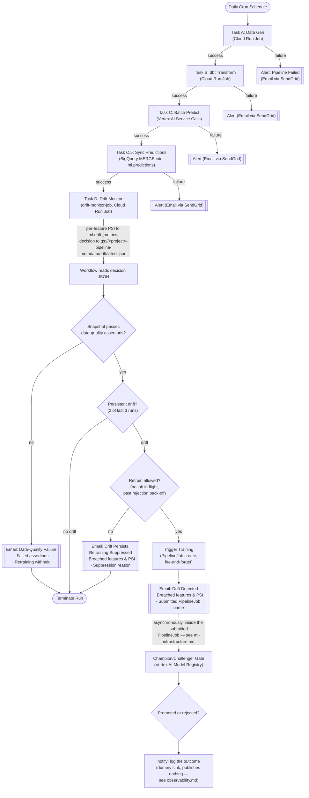

# Event-Driven Orchestration Strategy

Relying on independent, hardcoded cron intervals for data and machine learning workloads creates an operational anti-pattern where tasks run on incomplete or missing inputs. This architecture replaces time-based gaps with a strict Directed Acyclic Graph (DAG) managed by a serverless orchestration engine.

## The Daily Inference Graph

A single master scheduler initiates the orchestration workflow once per day. The workflow engine manages the execution sequence step-by-step:

1. **Ingestion Execution:** The data simulation task is triggered. The orchestrator polls the underlying execution status, waiting for a deterministic completion signal before advancing.
2. **Feature Transformation:** Upon ingestion success, the orchestrator invokes the feature engineering container. The SQL compilation and data transformation DAG must execute without errors to update the analytical tables.
3. **Batch Prediction:** Once feature availability is confirmed and a champion model is registered, the workflow submits a Vertex AI `BatchPredictionJob` against the champion, polling it to completion. If no champion is registered yet (first-ever run), the workflow stops here cleanly — there's nothing to score or monitor yet.
4. **Prediction Sync:** The `sync_predictions_to_ml_predictions` subworkflow reconciles the batch-predict job's unmanaged, auto-named scratch output table into the clean `ml.predictions` schema via a single BigQuery `MERGE` keyed on `(customer_id, snapshot_date)`, so the daily scoring run is queryable as a stable business-facing table, not just Vertex's own scratch table.
5. **Drift Monitoring:** `drift-monitor-job` (a Cloud Run Job) compares the latest feature snapshot's distribution against the champion's frozen training-time baseline (PSI per feature, missingness included), runs data-quality assertions against the snapshot itself, appends the per-feature PSI to `ml.drift_metrics`, and writes its decision to GCS, which the workflow reads back to decide whether to retrain.

If any stage within the pipeline encounters an unrecoverable exception, the orchestrator halts downstream blocks, handles error states smoothly, isolates the failure context, and broadcasts immediate alerts to designated monitoring integrations.

## The Retraining Loop

The machine learning training lifecycle operates independently from daily scoring routines. Today retraining is purely drift-triggered, and a breach has to clear four gates before a `PipelineJob` is submitted:

1. **Calibration** — the feature's PSI must exceed both the configured effect size and the sampling-noise floor for that snapshot's size.
2. **Persistence** — the breach must repeat (default 2 of the last 3 runs). A single night is not evidence of a distribution shift.
3. **Data quality** — the snapshot must pass absolute assertions on row volume, key uniqueness, schema, null rates and column variance. A defect moves distributions just as drift does, but retraining on one bakes it into the model, and the promotion gate cannot catch that because the challenger is evaluated against the same bad data.
4. **Back-off** — no retraining pipeline may already be in flight, and if previous challengers were rejected the next attempt waits (1, 2 then 7 days as rejections accumulate). A promotion resets the counter, so the next genuine drift retrains immediately.

Only then does the orchestrator submit the staged KFP template as a Vertex AI `PipelineJob` directly (no Pub/Sub hop, no separate trigger service) and move on without waiting for it to finish.

The job is submitted with an explicit `pipelineJobId` of the form `churn-training-retrain-2026-09-07-153012`, so runs are identifiable wherever the resource name surfaces — Cloud Logging, the drift email, the suppression message — instead of Vertex's generated numeric id. `displayName` deliberately stays constant at `churn-training-retrain`, because `last_retrain_status` matches it literally to enforce the in-flight and minimum-interval guards; making it unique per run would stop both from matching anything.

A deterministic id also makes submission idempotent, which matters for the ambiguous retry: if the create reaches Vertex but the response is lost, `http.default_retry` would otherwise start a **second** training run — two pipelines racing over the same `ml.split_assignments` partition. Instead the retry returns `409 ALREADY_EXISTS`, which is the confirmation that the intended job exists, so the workflow fetches it by name and continues. Regenerating the timestamp on each attempt would bring the duplicate back and discard the only signal separating "it worked" from "it didn't". A breach that clears the first two gates but is blocked by the third still sends an email naming the suppression reason. See [observability.md](observability.md) for the mechanics of each gate. A baseline monthly schedule independent of drift is not yet built.

---

## Manual Test Runs: Skipping Stages

The daily DAG is sequential by design, which makes iterating on its tail — drift monitoring and the retraining trigger — expensive: a full run regenerates CDC data, rebuilds every dbt model and boots a `BatchPredictionJob` container before reaching the part under test. Three optional boolean arguments let a manual execution start further down the graph:

| Argument | Skips | Effect |
|----------|-------|--------|
| `skip_data_gen` | `data-gen-job` | Raw CDC tables are left exactly as they are. |
| `skip_dbt` | `dbt-job` | `customer_features` is not rebuilt, so a hand-staged snapshot survives. |
| `skip_batch_predict` | `submit_batch_predict` **and** `sync_predictions_to_ml_predictions` | No new scoring run; `ml.predictions` keeps yesterday's values. |

All three default to `false` and are read with `map.get`/`default`, so they are simply absent from Cloud Scheduler's HTTP body and the production run is unchanged. `fetch_champion` always runs — drift monitoring is meaningless without a champion baseline, so the "no champion registered yet" early exit stays in force regardless of skips.

```bash
gcloud workflows run orchestrator-workflow \
  --location=<region> \
  --data='{
    "project_id": "<project>",
    "region": "<region>",
    "alert_email": "<you@example.com>",
    "alert_from_email": "<alerts@example.com>",
    "alerts_enabled": false,
    "skip_data_gen": true,
    "skip_dbt": true,
    "skip_batch_predict": true
  }'
```

Two consequences are worth knowing before trusting the output of a skipped run:

- **Skipping dbt without skipping data gen is the odd combination.** New raw events land but are never transformed, so the drift monitor reads the previous snapshot while the warehouse has moved on. Either skip both or skip neither, unless the divergence is the thing being tested.
- **Skipping batch predict leaves the score-distribution check on stale input.** `drift_monitor.predictions.fetch_latest_predictions` looks up the champion's most recent *completed* daily-scoring `BatchPredictionJob`, so it will find the previous day's. Feature PSI — the signal that actually drives retraining — is computed straight from the feature snapshot and is unaffected. If no daily-scoring job has ever run, the check degrades to "no score signal this run" rather than failing (see [observability.md](observability.md)).

The persistence gate counts *runs*, not days — `prior_breach_counts` looks at the last N rows in `ml.drift_metrics` for the current champion regardless of when they landed. Two skipped runs back to back over a drifted snapshot therefore satisfy "2 of the last 3" in minutes rather than nights, which is what makes the retraining trigger testable at all; the same property means throwaway test runs are permanently part of the history the production gate reads.

Skips do not weaken the gates downstream of them: data-quality assertions, PSI persistence across runs, and the retrain back-off all still apply, so a test run can legitimately decide *not* to retrain. `alerts_enabled: false` is the usual choice for these runs, since the drift and suppression emails are otherwise indistinguishable from production alerts.

---

## End-To-End Execution Flow (Google Cloud Workflows)

Below is the concrete sequence executed step-by-step by the serverless orchestration component. Tasks run inside deterministic isolation, sharing features directly through BigQuery and models via the Vertex registry.


