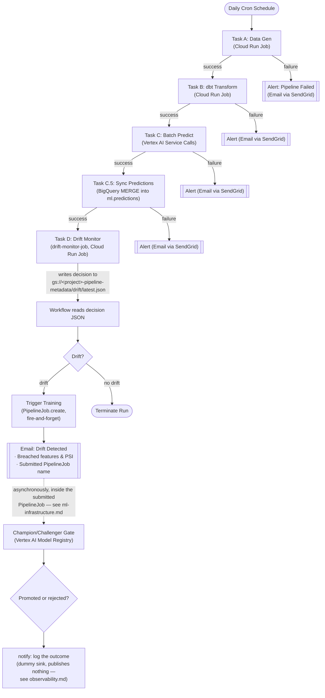

# Event-Driven Orchestration Strategy

Relying on independent, hardcoded cron intervals for data and machine learning workloads creates an operational anti-pattern where tasks run on incomplete or missing inputs. This architecture replaces time-based gaps with a strict Directed Acyclic Graph (DAG) managed by a serverless orchestration engine.

## The Daily Inference Graph

A single master scheduler initiates the orchestration workflow once per day. The workflow engine manages the execution sequence step-by-step:

1. **Ingestion Execution:** The data simulation task is triggered. The orchestrator polls the underlying execution status, waiting for a deterministic completion signal before advancing.
2. **Feature Transformation:** Upon ingestion success, the orchestrator invokes the feature engineering container. The SQL compilation and data transformation DAG must execute without errors to update the analytical tables.
3. **Batch Prediction:** Once feature availability is confirmed and a champion model is registered, the workflow submits a Vertex AI `BatchPredictionJob` against the champion, polling it to completion. If no champion is registered yet (first-ever run), the workflow stops here cleanly — there's nothing to score or monitor yet.
4. **Prediction Sync:** The `sync_predictions_to_ml_predictions` subworkflow reconciles the batch-predict job's unmanaged, auto-named scratch output table into the clean `ml.predictions` schema via a single BigQuery `MERGE` keyed on `(customer_id, snapshot_date)`, so the daily scoring run is queryable as a stable business-facing table, not just Vertex's own scratch table.
5. **Drift Monitoring:** `drift-monitor-job` (a Cloud Run Job) compares the latest feature snapshot's distribution against the champion's frozen training-time baseline (PSI per feature) and writes its decision to GCS, which the workflow reads back to decide whether to retrain.

If any stage within the pipeline encounters an unrecoverable exception, the orchestrator halts downstream blocks, handles error states smoothly, isolates the failure context, and broadcasts immediate alerts to designated monitoring integrations.

## The Retraining Loop

The machine learning training lifecycle operates independently from daily scoring routines. Today retraining is purely drift-triggered: when the drift monitor flags a breach, the orchestrator workflow submits the staged KFP template as a Vertex AI `PipelineJob` directly (no Pub/Sub hop, no separate trigger service) and moves on without waiting for it to finish. A baseline monthly schedule independent of drift is not yet built.

---

## End-To-End Execution Flow (Google Cloud Workflows)

Below is the concrete sequence executed step-by-step by the serverless orchestration component. Tasks run inside deterministic isolation, sharing features directly through BigQuery and models via the Vertex registry.

